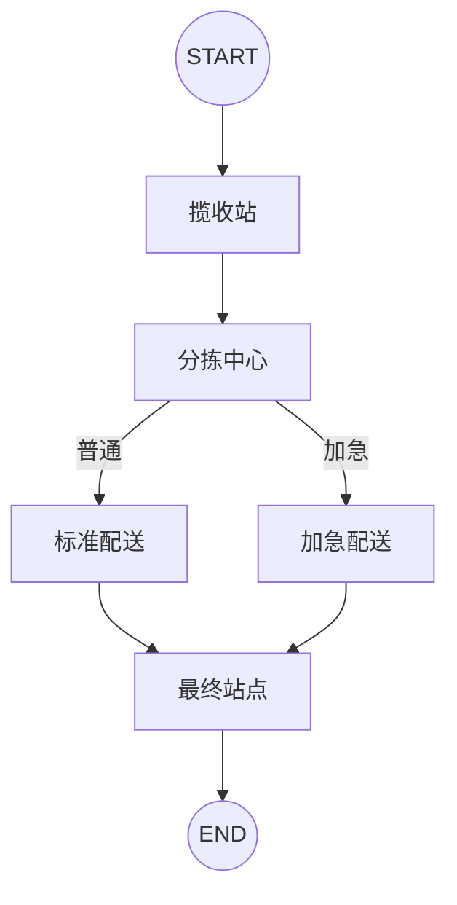

# 02｜LangGraph 状态图：包裹配送与条件路由

这份笔记用一个不调用大模型、可以直接运行的物流例子，理解 LangGraph 最核心的五个概念：**状态、节点、边、条件路由和 Reducer（归并器）**。

## 一句话理解

LangGraph 可以把业务流程画成一张“会执行的流程图”：数据保存在共享状态里，每经过一个节点，节点只返回自己要修改的字段，图再决定下一步走向哪里。

## 流程图



普通件和加急件只有配送方式不同，其余步骤可以复用：

```text
普通件：START → 揽收站 → 分拣中心 → 标准配送 → 最终站点 → END
加急件：START → 揽收站 → 分拣中心 → 加急配送 → 最终站点 → END
```

## 1. 状态：整个图共用的一张数据表

```python
class PackageState(TypedDict):
    package_id: str
    origin: str
    destination: str
    status: str
    history: Annotated[list[str], operator.add]
    total_distance: Annotated[int, operator.add]
    priority: str
```

`TypedDict` 描述状态中有哪些键以及每个值的类型。它不会创建一个新的业务对象；运行时传入和得到的仍然是字典。

本例中的字段可以分为三组：

| 类型 | 字段 | 作用 |
| --- | --- | --- |
| 包裹信息 | `package_id`、`origin`、`destination` | 描述包裹本身 |
| 流程结果 | `status`、`history`、`total_distance` | 记录配送进展 |
| 路由依据 | `priority` | 决定走普通还是加急路线 |

## 2. Reducer：决定“覆盖”还是“累加”

普通状态字段收到新值时，默认会被覆盖。例如每个节点返回新的 `status`，所以最后只留下 `"已签收"`。

```python
status: str
```

历史和里程需要累计，因此使用 `Annotated` 给字段绑定 `operator.add`：

```python
history: Annotated[list[str], operator.add]
total_distance: Annotated[int, operator.add]
```

可以把它理解成：

```text
旧值 + 节点返回的新值 = 更新后的状态
```

所以各节点虽然每次只返回一条历史，最终仍会得到完整列表：

```python
["在北京揽收", "分拣至上海分拣中心", "标准陆运", "已送达上海"]
```

> 注意：`history` 的节点更新必须是列表，例如 `{"history": ["标准陆运"]}`，不能写成字符串。

## 3. 节点：读取完整状态，只返回局部更新

节点是普通 Python 函数。输入是当前完整状态，输出只需要包含本节点要更新的字段。

```python
def receive_package(state: PackageState):
    return {
        "status": "已揽收",
        "history": [f"在{state['origin']}揽收"],
    }
```

这里没有返回 `package_id`、`destination` 等字段，它们不会丢失。LangGraph 会把局部更新合并回共享状态。

## 4. 固定边：流程一定会经过的连接

```python
delivery.add_edge(START, "揽收站")
delivery.add_edge("揽收站", "分拣中心")
delivery.add_edge("最终站点", END)
```

`START` 和 `END` 是虚拟节点，分别表示流程入口和出口。固定边没有判断，到达起点后一定会进入指定节点。

## 5. 条件边：根据状态选择下一条路

路由函数检查优先级并返回一个**路径标签**：

```python
def select_delivery(state: PackageState):
    if state["priority"] == "加急":
        return "备注加急"
    return "无备注"
```

再用映射表把路径标签翻译成真实节点名：

```python
delivery.add_conditional_edges(
    "分拣中心",
    select_delivery,
    {
        "备注加急": "加急配送",
        "无备注": "标准配送",
    },
)
```

因此，`select_delivery` 返回的不是函数，也不是直接执行的节点；它返回字符串标签，LangGraph 再查表决定下一站。

## 6. 编译与执行

`StateGraph` 是流程的“设计图”，需要先编译才能运行：

```python
delivery_system = delivery.compile()
result = delivery_system.invoke(package)
```

`invoke()` 接收初始状态并返回流程结束后的完整状态。本例没有使用模型、API Key 或数据库，所以安装依赖后即可运行。

## 运行方法

在仓库根目录执行：

```bash
pip install -r requirements.txt
python langgraph_package_delivery.py
```

预期结果：

```text
配送包裹: P001
最终状态: 已签收
配送历史: ['在北京揽收', '分拣至上海分拣中心', '标准陆运', '已送达上海']
总里程: 500

配送包裹: P002
最终状态: 已签收
配送历史: ['在广州揽收', '分拣至其他地区分拣中心', '空运加急', '已送达乌鲁木齐']
总里程: 800
```

## 原始代码中的两个小改进

1. 初始字典补上了 `status: "待揽收"`，使输入与 `PackageState` 的类型声明完全一致。
2. 分拣函数中的变量 `next` 改成 `sorting_center`，避免覆盖 Python 内置的 `next()` 函数。

这些并不改变流程逻辑，但能让代码更规范，也更方便类型检查和后续扩展。

## 常见错误

- **Reducer 字段忘记给初始值**：本例给 `history` 传 `[]`，给 `total_distance` 传 `0`。
- **把历史写成字符串**：`operator.add` 在列表字段上要求新值也是列表。
- **路由标签拼写不一致**：路由函数返回值必须能在条件边的映射表中找到。
- **忘记编译**：需要调用 `compile()`，不能直接对 `StateGraph` 调用 `invoke()`。
- **把状态全部重复返回**：节点只返回有变化的字段即可。

## 复习问答

<details>
<summary>1. 为什么 history 不会被后一个节点覆盖？</summary>

因为它通过 `Annotated` 绑定了 `operator.add`。每次节点返回的新列表都会追加到旧列表。

</details>

<details>
<summary>2. select_delivery 为什么不直接返回“加急配送”？</summary>

本例把判断结果与节点名分开：路由函数返回业务标签，条件边映射表再把标签映射到节点。这样路由语义更清楚，节点改名时也只需修改映射。

</details>

<details>
<summary>3. 节点只返回 status 和 history，其他字段会消失吗？</summary>

不会。节点返回的是局部更新，LangGraph 会把它合并到现有共享状态中。

</details>

<details>
<summary>4. StateGraph 和编译后的 delivery_system 有什么区别？</summary>

前者是用于添加节点和边的构建器，后者才是可以通过 `invoke()`、`stream()` 等方式执行的图。

</details>

## 可以继续练习

- 根据真实城市计算不同里程，而不是固定为 500 或 800。
- 新增“易碎品”路线和专门处理节点。
- 在节点中模拟异常，学习重试与错误处理。
- 使用持久化检查点，让配送流程可以中断后恢复。
- 使用 `stream()` 逐步查看每个节点产生的更新。

## 完整源码

见 [`langgraph_package_delivery.py`](../langgraph_package_delivery.py)。

