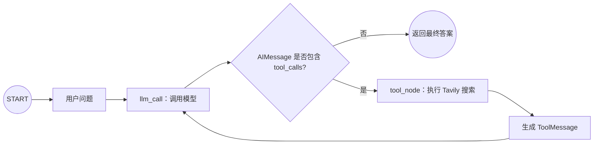

# 03｜LangGraph 工具调用 Agent：让大模型决定是否搜索

这份笔记用一个“天气问题需要联网搜索、简单问题直接回答”的例子，手写一个最小可用的工具调用 Agent。读完后应能理解：**模型如何申请调用工具、程序如何真正执行工具、工具结果如何交还模型，以及 LangGraph 为什么需要循环和终止条件。**

## 一句话理解

`bind_tools()` 只是把工具的名称、参数和说明告诉模型；模型不会亲自执行 Python 函数。模型先返回一条带 `tool_calls` 的 `AIMessage`，程序执行对应工具并生成 `ToolMessage`，然后再次调用模型，让模型结合搜索结果组织最终答案。

## 最终流程



它不是固定调用搜索，而是让模型自己判断：

```text
“1 + 1 等于几？”
HumanMessage → AIMessage（直接回答）→ END

“今天离石的天气怎么样？”
HumanMessage
→ AIMessage（提出 Tavily 工具调用）
→ ToolMessage（搜索结果）
→ AIMessage（整理后的最终答案）
→ END
```

## 1. 先理解四种消息

| 消息类型 | 谁产生 | 在本例中的作用 |
| --- | --- | --- |
| `SystemMessage` | 程序 | 告诉模型身份和规则 |
| `HumanMessage` | 用户 | 保存用户输入的问题 |
| `AIMessage` | 大模型 | 保存直接回答，或保存调用工具的请求 |
| `ToolMessage` | 工具节点 | 保存工具执行结果，并交回大模型 |

最容易混淆的是前两次 `AIMessage`：

- 第一次 `AIMessage` 可能没有自然语言答案，主要携带 `tool_calls`。
- 工具执行之后，第二次 `AIMessage` 才是结合搜索结果写出的最终答案。

## 2. 安装依赖与配置环境变量

在仓库根目录安装：

```bash
pip install -r requirements.txt
```

在项目根目录创建 `.env`，不要把真实密钥提交到 GitHub：

```env
TAVILY_API_KEY=你的_Tavily_API_Key
DEEPSEEK_API_KEY=你的模型_API_Key
MODEL_NAME=deepseek-v4-pro
```

仓库的 `.gitignore` 已忽略 `.env`。

> `TAVILY_API_KEY` 是 Tavily 使用的固定变量名。模型密钥的变量名取决于模型提供商；如果不是 DeepSeek，请按对应集成的文档修改。`MODEL_NAME` 也必须是当前模型服务实际支持、并且支持工具调用的模型。

## 3. 准备工具和模型

```python
search = TavilySearch(max_results=4)
tools = [search]

model = init_chat_model(MODEL_NAME, temperature=0)
model_with_tools = model.bind_tools(tools)
```

这里需要区分三个对象：

| 对象 | 含义 |
| --- | --- |
| `search` | 真正可以执行搜索的 Tavily 工具 |
| `model` | 普通聊天模型 |
| `model_with_tools` | 已经知道“有哪些工具、各工具需要什么参数”的模型 |

`bind_tools()` 不会立即搜索。它主要把工具说明转换成模型能够理解的工具 Schema，并在每次模型调用时一并发送。

## 4. 状态：保存消息历史和调用次数

```python
class MessagesState(TypedDict):
    messages: Annotated[list[AnyMessage], operator.add]
    llm_calls: int
```

`messages` 通过 `Annotated` 绑定了 `operator.add`。因此节点返回新消息时，LangGraph 会把它们追加到旧列表：

```text
旧消息列表 + 节点返回的新消息列表 = 新状态中的完整消息列表
```

例如天气问题的状态会依次变成：

```text
[H]
[H, A(tool_calls)]
[H, A(tool_calls), T]
[H, A(tool_calls), T, A(final)]
```

其中 `H`、`A`、`T` 分别代表 `HumanMessage`、`AIMessage` 和 `ToolMessage`。

`llm_calls` 没有绑定 Reducer，所以节点返回的新整数会覆盖旧整数。节点先读取当前值再加一：

```python
"llm_calls": state.get("llm_calls", 0) + 1
```

## 5. LLM 节点：让模型决定下一步

```python
def llm_call(state: MessagesState):
    messages = state["messages"]

    result = model_with_tools.invoke(
        [SystemMessage(content="你是一个乐于助人的助手，支持调用工具进行搜索")]
        + messages
    )

    return {
        "messages": [result],
        "llm_calls": state.get("llm_calls", 0) + 1,
    }
```

这个节点可能从两个位置进入：

1. 从 `START` 第一次进入，此时通常只有 `[HumanMessage]`。
2. 从 `tool_node` 回来，此时通常是 `[HumanMessage, AIMessage, ToolMessage]`。

模型返回的 `result` 一定是 `AIMessage`，但内容存在两种情况：

- 需要外部信息：`result.tool_calls` 非空。
- 已经可以回答：`result.tool_calls` 为空，`result.content` 是最终回答。

`SystemMessage` 每次调用模型时都会放在消息列表最前面，但它没有写回状态，因此最终打印的状态中通常看不到它。

## 6. 为什么工具节点的最后一条消息带有 `tool_calls`

工具节点里有这段代码：

```python
for tool_call in state["messages"][-1].tool_calls:
    ...
```

`[-1]` 表示取消息列表最后一项。这里能够直接读取 `tool_calls`，是因为前面的路由函数已经做了筛选：

```python
def should_continue(state: MessagesState):
    last_message = state["messages"][-1]

    if isinstance(last_message, AIMessage) and last_message.tool_calls:
        return "tool_node"

    return END
```

只有最后一条消息是带工具调用请求的 `AIMessage` 时，流程才会进入 `tool_node`；否则直接结束。因此这是由图的路由规则保证的，不是任意时刻都成立。

## 7. 工具节点：把“调用请求”变成“调用结果”

先建立工具名称到工具对象的映射：

```python
tools_by_name = {tool.name: tool for tool in tools}
```

模型返回的单个工具调用一般包含：

```python
{
    "name": "tavily_search",
    "args": {"query": "今天离石天气"},
    "id": "call_xxx",
    "type": "tool_call",
}
```

工具节点的核心步骤是：

```python
tool = tools_by_name[tool_call["name"]]
observation = tool.invoke(tool_call["args"])
```

模型只负责提供 `name` 和 `args`；真正执行搜索的是 Python 程序中的 `tool.invoke()`。

执行完后必须构造 `ToolMessage`：

```python
ToolMessage(
    content=content,
    tool_call_id=tool_call["id"],
    name=tool_call["name"],
)
```

其中 `tool_call_id` 非常重要。它把工具结果和之前的调用请求对应起来；如果模型一次申请多个工具，这个 ID 可以避免结果错配。

## 8. 条件边与循环

```python
agent_builder.add_conditional_edges(
    "llm_call",
    should_continue,
    {
        "tool_node": "tool_node",
        END: END,
    },
)

agent_builder.add_edge("tool_node", "llm_call")
```

这里形成了 Agent 的核心闭环：

```text
llm_call → 判断 → tool_node → llm_call → 再判断
```

为什么工具执行后还要回到模型？因为 Tavily 返回的是搜索数据，模型还需要阅读这些数据并组织成面向用户的自然语言答案。

这个循环也允许模型连续调用工具。不过如果模型一直要求调用工具，流程可能无法自然结束。实际项目可以给 `invoke()` 设置 `recursion_limit`，并增加调用次数、超时和异常处理等保护。

## 9. 编译和执行

```python
agent_search = agent_builder.compile()

result = agent_search.invoke(
    {
        "messages": [HumanMessage(content="今天离石的天气怎么样？")],
        "llm_calls": 0,
    },
    config={"recursion_limit": 10},
)
```

`StateGraph` 是流程设计图，调用 `compile()` 后才得到真正可运行的图。

初始状态中给 `llm_calls` 传入 `0`，与 `MessagesState` 的类型声明保持一致。`recursion_limit` 用来防止意外的无限循环。

## 10. 最后的消息格式从哪里来

```python
for msg in result["messages"]:
    msg.pretty_print()
```

`pretty_print()` 是 `langchain-core` 消息类提供的展示方法，不是 LangGraph 节点定义的。它会根据消息的 `type` 打印标题：

```text
human → Human Message
ai    → Ai Message
tool  → Tool Message
```

`AIMessage` 还会额外展示 `Tool Calls`、`Call ID` 和 `Args`。这些只是便于调试的显示格式，不会改变状态内容。

如果只想看最终答案，可以直接读取最后一条消息：

```python
print(result["messages"][-1].content)
```

## 11. 两类输入的执行对比

### 输入需要实时信息

```python
HumanMessage(content="今天离石的天气怎么样？")
```

通常会调用两次模型：

1. 第一次判断需要搜索，并返回工具调用请求。
2. 第二次读取搜索结果，生成最终答案。

中间还会执行一次 Tavily 工具。

### 输入不需要外部信息

```python
HumanMessage(content="1 + 1 等于几？")
```

模型可以直接回答，通常只调用一次模型，并且不会进入 `tool_node`。

> 是否调用工具最终由模型决定。同一个问题在不同模型、提示词或参数下可能有不同选择。

## 12. 原始代码中的实用改进

完整示例对原代码做了几项不改变核心逻辑的小改进：

1. 使用 `python-dotenv` 自动加载本地 `.env`。
2. 通过 `MODEL_NAME` 环境变量切换模型，避免把模型名称写死。
3. 给初始状态补充 `llm_calls: 0`，与类型声明一致。
4. 在路由和工具节点中检查最后一条消息是否为 `AIMessage`。
5. 将字典或列表形式的工具结果序列化成字符串，再放入 `ToolMessage.content`。
6. 给执行设置 `recursion_limit`，避免异常循环无限持续。
7. 删除未实际使用的 Matplotlib 导入；图结构直接用 Mermaid 记录在笔记中。

## 13. 常见错误

### 找不到 Tavily API Key

```text
Did not find tavily_api_key
```

确认 `.env` 中的变量名是：

```env
TAVILY_API_KEY=你的密钥
```

并确保 `load_dotenv()` 在创建 `TavilySearch` 之前执行。

### 模型不支持工具调用

如果 `bind_tools()` 报错，或模型始终不生成 `tool_calls`，需要确认当前模型和模型服务支持 Tool Calling，并安装对应的 LangChain 集成包。

### 工具名称找不到

```text
KeyError: '某个工具名'
```

说明模型返回的工具名不在 `tools_by_name` 中。检查绑定给模型的工具列表和实际执行的工具列表是否一致。

### 忘记传 `tool_call_id`

工具结果必须用原调用的 ID 创建 `ToolMessage`，否则部分模型服务会拒绝后续请求，或无法把结果与调用正确配对。

### f-string 引号冲突

错误写法：

```python
print(f"一共调用了{result["llm_calls"]}次LLM")
```

正确写法：

```python
print(f"一共调用了{result['llm_calls']}次LLM")
```

### 把 `bind_tools()` 理解成自动执行工具

`bind_tools()` 只是让模型能够生成结构化的工具调用请求。执行工具、捕获异常以及把结果包装成 `ToolMessage`，仍然由应用代码负责。

## 14. 复习问答

<details>
<summary>1. 为什么 messages 不会被新消息覆盖？</summary>

因为 `messages` 字段通过 `Annotated` 绑定了 `operator.add`，节点返回的新消息列表会追加到原列表。

</details>

<details>
<summary>2. 为什么进入 tool_node 时，最后一条消息一定带有 tool_calls？</summary>

因为 `should_continue()` 只有在最后一条消息是带 `tool_calls` 的 `AIMessage` 时才返回 `"tool_node"`，否则流程直接进入 `END`。

</details>

<details>
<summary>3. 模型是否真的执行了 TavilySearch？</summary>

没有。模型只返回工具名称和参数；真正执行搜索的是 `tool_node` 中的 `tool.invoke(tool_call["args"])`。

</details>

<details>
<summary>4. 为什么工具执行后还要再次调用模型？</summary>

工具返回的是观察结果或原始数据，模型需要读取这些结果，结合用户问题生成最终自然语言答案。

</details>

<details>
<summary>5. tool_call_id 有什么作用？</summary>

它用于关联某次工具调用请求和对应的工具结果，尤其在一次产生多个工具调用时非常重要。

</details>

<details>
<summary>6. 为什么简单问题只调用一次模型？</summary>

第一次模型调用已经能直接产生答案，`tool_calls` 为空，所以条件路由直接进入 `END`，不会执行工具节点或第二次模型调用。

</details>

## 15. 可以继续练习

- 再添加一个计算器工具，观察模型如何在搜索和计算之间选择。
- 让一次问题同时触发多个工具调用。
- 使用 LangGraph 预构建的 `ToolNode` 替代手写 `tool_node`，比较两种写法。
- 使用 `stream()` 逐步输出每个节点的状态更新。
- 给 Tavily 调用增加超时、重试和异常消息。
- 使用 Checkpointer 保存会话，实现多轮对话和中断恢复。
- 增加最大工具调用次数，超过限制后返回友好提示。

## 16. 官方资料

- [LangGraph Graph API](https://docs.langchain.com/oss/python/langgraph/graph-api)
- [LangChain Messages](https://docs.langchain.com/oss/python/langchain/messages)
- [LangChain Models 与 Tool Calling](https://docs.langchain.com/oss/python/langchain/models)
- [Tavily Chat 示例](https://docs.tavily.com/examples/use-cases/chat)

## 完整源码

见 [`langgraph_tavily_search_agent.py`](../langgraph_tavily_search_agent.py)。

