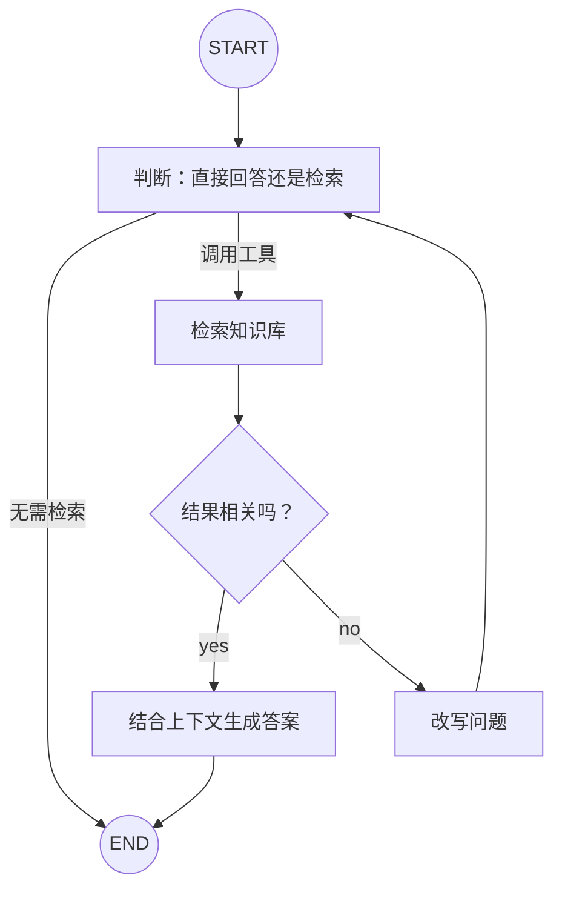

# 04｜LangGraph Agentic RAG：让检索系统会判断、会改写

这份笔记把普通 RAG 升级成一个带决策能力的检索 Agent。系统不再机械地“检索一次就回答”，而是先决定是否需要检索，再检查检索结果是否相关；如果结果不理想，就改写问题并重新检索。

## 一句话理解

普通 RAG 是一条固定流水线；Agentic RAG 把检索、评分、改写和回答做成一个可循环的状态图，让模型根据当前结果选择下一步。

## 最终流程



这里有两条典型路径：

```text
知识库问题：提问 → 检索 → 相关性评分 → 生成答案 → 结束

首次检索不理想：提问 → 检索 → 评分不通过 → 改写问题
               → 再次判断 → 重新检索 → 评分通过 → 生成答案
```

## 1. 它和普通 RAG 有什么不同

| 对比项 | 普通 RAG | Agentic RAG |
| --- | --- | --- |
| 是否检索 | 通常固定检索 | 模型决定是否调用检索工具 |
| 结果检查 | 经常直接使用 | 单独判断结果是否相关 |
| 检索失败 | 直接生成，容易答非所问 | 改写问题后再次尝试 |
| 流程形状 | 单向链 | 带条件分支和循环的图 |
| 适合场景 | 流程简单、问题稳定 | 问法多样、检索质量不稳定 |

Agentic RAG 并不意味着一定更好。它多了模型调用和循环，成本与延迟也会增加；这个例子的价值主要是学习如何把“判断与纠错”放进 LangGraph 工作流。

## 2. 知识库如何准备

示例把仓库内 `Docs/markdown/` 下的五份 Markdown 文件作为知识库。加载过程分三步：

```text
Markdown 文件 → Document 列表 → 文本块 → 向量
```

先逐个加载文档：

```python
documents = []
for path in DOCUMENT_PATHS:
    documents.extend(UnstructuredMarkdownLoader(str(path)).load())
```

再使用 `RecursiveCharacterTextSplitter` 切分：

```python
text_splitter = RecursiveCharacterTextSplitter.from_tiktoken_encoder(
    encoding_name="cl100k_base",
    chunk_size=1000,
    chunk_overlap=50,
)
doc_splits = text_splitter.split_documents(documents)
```

- `chunk_size=1000`：每个文本块的目标上限是 1000 个 token。
- `chunk_overlap=50`：相邻文本块保留 50 个 token 的重叠，减少内容刚好在切分处断裂的问题。
- `from_tiktoken_encoder()`：用 tokenizer 计算长度，比简单按字符数更接近模型真正接收的文本规模。

## 3. 向量存储与检索器

```python
vectorstore = InMemoryVectorStore.from_documents(
    documents=doc_splits,
    embedding=embeddings,
)
retriever = vectorstore.as_retriever(search_kwargs={"k": 2})
```

嵌入模型把每个文本块转换成向量。用户问题也会被转换成向量，检索器再找出语义上最接近的文本块。

`k=2` 表示每次返回两个候选文本块。它不是越大越好：太小可能漏掉信息，太大则可能带入噪声并增加上下文长度。

这里使用 `InMemoryVectorStore`，程序退出后索引就会消失，每次启动都会重新计算嵌入。它适合学习和小型演示；生产项目通常会改用持久化向量数据库。

## 4. 为什么把检索器包装成工具

```python
retriever_tool = create_retriever_tool(
    retriever,
    "retrieve_knowledge_base",
    "搜索并返回有关比特就业课程或租房平台项目的知识库内容。",
)
```

普通 RAG 会在每次请求中固定执行检索。包装成工具后，模型可以先阅读问题，再决定是否生成工具调用请求。

工具的名称和描述很重要：模型会根据描述判断它能解决什么问题。描述应明确知识库的范围，避免写成“万能搜索”。

## 5. 状态为什么只需要 messages

示例直接使用 LangGraph 提供的 `MessagesState`：

```python
def generate_query_or_respond(state: MessagesState):
    ...
```

它的核心是一个会自动追加的消息列表。运行过程中，状态可能依次变成：

```text
[HumanMessage(原问题)]
[HumanMessage, AIMessage(工具调用)]
[HumanMessage, AIMessage, ToolMessage(检索结果)]
[HumanMessage, AIMessage, ToolMessage, AIMessage(最终答案)]
```

如果评分不通过，还会追加改写后的 `HumanMessage`，然后重新进入判断节点。

## 6. 第一个节点：决定检索还是直接回答

```python
def generate_query_or_respond(state: MessagesState):
    response = model.bind_tools([retriever_tool]).invoke(state["messages"])
    return {"messages": [response]}
```

`bind_tools()` 把工具说明交给模型，但不会执行工具。模型可能返回：

- 普通 `AIMessage`：说明它选择直接回答，流程结束。
- 带 `tool_calls` 的 `AIMessage`：说明它申请调用知识库工具，流程进入 `retrieve`。

`tools_condition` 负责检查这两种情况：

```python
workflow.add_conditional_edges(
    "generate_query_or_respond",
    tools_condition,
    {"tools": "retrieve", "__end__": END},
)
```

## 7. ToolNode 真正执行检索

```python
retriever_node = ToolNode([retriever_tool])
```

`ToolNode` 会读取上一条 `AIMessage` 中的工具名称和参数，找到对应工具并执行，然后把结果包装成 `ToolMessage` 追加到状态。

因此要记住：

```text
模型提出调用请求 ≠ 工具已经执行
ToolNode 执行工具 = 真正发生检索
```

## 8. 给检索结果打分

检索之后，`grade_documents()` 同时读取最近一次用户查询与最新的工具结果：

```python
latest_question = filter_messages(
    state["messages"], include_types="human"
)[-1].content
context = state["messages"][-1].content
```

这里使用“最近一次”HumanMessage，而不是永远读取第一条，因为问题可能已经经过改写。

评分结果使用结构化输出：

```python
class GradeDocuments(BaseModel):
    score: Literal["yes", "no"]
```

相比让模型自由输出一段解释，结构化输出把可选值限制为 `yes` 或 `no`，更适合条件路由：

```python
return "generate_answer" if result.score == "yes" else "rewrite_question"
```

## 9. 不相关时为什么要改写问题

用户的自然语言问题可能太口语化、太宽泛，或者缺少知识库中的关键词。改写节点让模型生成更适合检索的查询：

```python
def rewrite_question(state: MessagesState):
    latest_question = filter_messages(
        state["messages"], include_types="human"
    )[-1].content
    prompt = REWRITE_PROMPT.format(question=latest_question)
    response = model.invoke([HumanMessage(content=prompt)])
    return {"messages": [HumanMessage(content=response.content)]}
```

改写结果故意保存为 `HumanMessage`，这样下一次进入决策节点时，模型会把它当作新的检索问题。

改写并不保证下一次一定成功，所以运行图时设置了 `recursion_limit`，防止“检索失败 → 改写 → 仍失败”无限循环。

## 10. 相关时如何生成答案

```python
original_question = state["messages"][0].content
context = state["messages"][-1].content
```

这里有一个容易忽略的设计：

- 评分时使用最近一次问题，因为要判断当前检索查询和结果是否匹配。
- 最终回答时使用第一条原始问题，因为用户真正想得到的是原问题的答案。

生成提示词还要求“只根据上下文回答”和“不知道就明确说不知道”，用于降低模型脱离知识库自由发挥的概率。

## 11. 安装与运行

在仓库根目录创建虚拟环境并安装依赖：

```bash
python -m venv .venv

# Windows PowerShell
.venv\Scripts\Activate.ps1

# macOS / Linux
source .venv/bin/activate

pip install -r requirements.txt
```

复制环境变量模板：

```bash
# Windows PowerShell
Copy-Item .env.example .env

# macOS / Linux
cp .env.example .env
```

然后把 `.env` 中的占位密钥替换为自己的密钥。模型服务需要同时支持 Tool Calling、结构化输出和嵌入接口。

运行示例：

```bash
python langgraph_agentic_rag.py
```

也可以在 `.env` 中修改 `QUESTION`，观察不同问题经过了哪些节点。

## 12. 如何阅读流式输出

代码使用 `graph.stream()`，每当一个节点完成时就打印该节点新增的最后一条消息：

```python
for chunk in graph.stream(...):
    for node, update in chunk.items():
        print(f"由节点 {node} 更新消息")
        update["messages"][-1].pretty_print()
```

关注节点顺序比只看最终答案更有学习价值。例如：

```text
generate_query_or_respond
retrieve
generate_answer
```

说明首次检索就通过评分。如果出现 `rewrite_question`，说明相关性评分认为首次检索结果不足。

## 13. 原始学习代码中的实用改进

完整示例保留了原始图结构，并补充了这些工程化细节：

1. 使用脚本所在目录拼接知识库路径，避免从不同工作目录运行时找不到文件。
2. 启动时检查五份知识库文件是否齐全，并列出缺失路径。
3. 使用 `.env` 和环境变量保存密钥、模型名、服务地址与测试问题。
4. 把评分字段限制为 `Literal["yes", "no"]`，让条件分支更稳定。
5. 把全部五份资料加入知识库，并让工具描述明确覆盖的主题。
6. 增加 `recursion_limit`，避免问题重写形成无限循环。
7. 使用 `if __name__ == "__main__"`，导入模块时不会自动执行示例问题。

## 14. 常见错误

### 找不到知识库文件

确认仓库结构中存在：

```text
Docs/markdown/*.md
```

不要只复制 Python 文件；知识库文档也是运行输入。

### 缺少解析依赖

`UnstructuredMarkdownLoader` 需要 `unstructured`，token 计数需要 `tiktoken`。请使用仓库中的完整 `requirements.txt` 安装依赖。

### API Key 未配置

不要把真实密钥写进 Python 或提交到 GitHub。复制 `.env.example` 为 `.env` 后填写本地密钥；`.env` 已被 `.gitignore` 忽略。

### 模型没有生成工具调用

模型可能认为问题可以直接回答，也可能不支持 Tool Calling。先确认模型能力，再检查检索工具的描述是否清楚。

### 结构化输出报错

相关性评分依赖模型返回符合 Schema 的结果。如果服务端不支持结构化输出，需要更换模型，或改为普通文本输出后手动校验 `yes/no`。

### 每次启动都很慢或产生嵌入费用

示例使用内存向量库，所以每次启动都会重新加载、切分并嵌入全部文档。这是演示代码的取舍；实际项目应缓存索引或使用持久化向量库。

## 15. 复习问答

<details>
<summary>1. Agentic RAG 比普通 RAG 多了哪些能力？</summary>

它可以决定是否检索、判断检索结果是否相关，并在结果不理想时改写问题后重新检索。

</details>

<details>
<summary>2. bind_tools() 是否会执行检索？</summary>

不会。它只让模型知道工具的名称、说明和参数。真正执行检索的是 `ToolNode`。

</details>

<details>
<summary>3. 为什么评分使用最近一次 HumanMessage？</summary>

因为问题可能已经被改写，评分需要比较当前检索查询与当前检索结果是否相关。

</details>

<details>
<summary>4. 为什么最终回答仍使用第一条消息？</summary>

第一条消息保存用户的原始问题。改写问题只是为了提高检索效果，最终目标仍是回答原问题。

</details>

<details>
<summary>5. InMemoryVectorStore 的主要限制是什么？</summary>

索引不会持久保存，程序重启后需要重新计算全部文档的嵌入，不适合大型或生产知识库。

</details>

<details>
<summary>6. recursion_limit 解决什么问题？</summary>

它限制图的最大递归步数，避免检索不相关与问题改写之间出现无法结束的循环。

</details>

## 16. 可以继续练习

- 在最终答案中附上检索文档的文件名和片段来源。
- 把内存向量库替换为可以持久化的向量数据库。
- 为“连续两次评分失败”增加专门的兜底回答。
- 分别统计检索、评分、改写和回答所消耗的时间与 token。
- 把评分从单一 `yes/no` 改成相关性分数，并设置阈值。
- 添加对话记忆，让用户可以围绕上一个答案继续追问。
- 为每个节点补充异常处理、重试和日志。

## 完整源码

见 [`langgraph_agentic_rag.py`](../langgraph_agentic_rag.py)。
