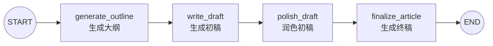

# 05｜LangGraph 顺序写作工作流：输入、内部状态与输出过滤

这份笔记用“生成大纲 → 写初稿 → 润色 → 生成终稿”的例子，学习如何把一个复杂任务拆成多个连续节点。读完后应能理解：**顺序工作流如何传递状态、`input_schema` 与 `output_schema` 有什么作用，以及为什么内部过程数据不会出现在最终返回值中。**

## 一句话理解

每个节点只负责一个写作阶段，并把结果写入共享状态；下一个节点读取前面已经生成的内容继续加工，最终只把 `final_content` 返回给调用者。

## 最终流程



这是一个固定顺序的工作流，没有条件分支，也没有循环：

```text
topic
  ↓
outline
  ↓
draft
  ↓
polished_draft
  ↓
final_content
```

## 1. 为什么要拆成四个节点

也可以用一次模型调用直接写文章，但拆分后每个步骤的职责更清楚：

| 节点 | 读取内容 | 新增内容 | 职责 |
| --- | --- | --- | --- |
| `generate_outline` | `topic` | `outline` | 确定文章结构 |
| `write_draft` | `topic`、`outline` | `draft` | 按大纲写初稿 |
| `polish_draft` | `topic`、`draft` | `polished_draft` | 改善表达与连贯性 |
| `finalize_article` | `topic`、`outline`、`polished_draft` | `final_content` | 检查结构并生成终稿 |

这种设计的优点是每一步都可以单独观察、修改和测试。缺点是一次任务要调用模型四次，耗时和费用通常会高于单次生成。

## 2. 三种状态 Schema

代码定义了外部输入、外部输出和内部完整状态：

```python
class InputState(TypedDict):
    topic: str


class OutputState(TypedDict):
    final_content: str


class State(InputState, OutputState):
    outline: str
    draft: str
    polished_draft: str
```

它们分别回答三个问题：

| Schema | 回答的问题 | 字段 |
| --- | --- | --- |
| `InputState` | 调用工作流时允许输入什么？ | `topic` |
| `State` | 节点执行过程中可以共享什么？ | 全部字段 |
| `OutputState` | 工作流结束后向外返回什么？ | `final_content` |

`State` 继承了 `InputState` 和 `OutputState`，所以内部完整状态实际包含：

```text
topic
outline
draft
polished_draft
final_content
```

## 3. input_schema：限制工作流入口

```python
builder = StateGraph(
    State,
    input_schema=InputState,
    output_schema=OutputState,
)
```

`input_schema=InputState` 表示调用者只需要提供主题：

```python
chain.invoke({"topic": "人工智能的未来发展"})
```

调用者不需要提前准备 `outline`、`draft` 或其他中间字段，它们会由后续节点逐步生成。

输入 Schema 的意义不只是类型提示，它还明确了图的公开入口。以后即使内部状态新增了更多字段，调用方式也可以保持稳定。

## 4. output_schema：过滤工作流出口

虽然内部状态保存了大纲、初稿和润色稿，但最终结果只包含：

```python
{"final_content": "...最终文章..."}
```

这是因为：

```python
output_schema=OutputState
```

把内部过程数据与外部返回值分开有两个好处：

1. 调用者只拿到真正需要的结果，不必了解内部实现。
2. 以后调整内部节点和字段时，不容易破坏外部接口。

这里的“过滤”是工作流接口设计，不应被当成敏感数据安全边界。日志和节点代码仍然可以接触内部状态。

## 5. 状态如何逐步增长

初始调用只有一个字段：

```python
{"topic": "人工智能的未来发展"}
```

节点返回的字典会更新到共享状态中：

```text
执行 generate_outline 后：
{topic, outline}

执行 write_draft 后：
{topic, outline, draft}

执行 polish_draft 后：
{topic, outline, draft, polished_draft}

执行 finalize_article 后：
{topic, outline, draft, polished_draft, final_content}
```

这些字段都是字符串，并且每个字段只由一个节点写入，因此本例不需要 Reducer。Reducer 通常用于多个节点可能同时更新同一字段，或者需要把新值追加到旧值时。

## 6. 一个节点的基本结构

以生成初稿为例：

```python
def write_draft(state: State):
    prompt = DRAFT_PROMPT.format(
        topic=state["topic"],
        outline=state["outline"],
    )
    result = model.invoke([HumanMessage(content=prompt)])
    return {"draft": result.content}
```

每个节点都遵循相同模式：

1. 从状态读取当前步骤需要的数据。
2. 把数据填入提示词。
3. 调用模型。
4. 返回本节点新生成的状态字段。

节点不需要返回完整状态。LangGraph 会把 `{"draft": ...}` 合并进已有状态，而不是丢弃 `topic` 和 `outline`。

## 7. Prompt Chaining：上一步成为下一步的上下文

这个工作流也是一个典型的 Prompt Chaining：

```text
第一个 Prompt 输出 outline
               ↓
第二个 Prompt 输入 topic + outline，输出 draft
               ↓
第三个 Prompt 输入 topic + draft，输出 polished_draft
               ↓
第四个 Prompt 输入 topic + outline + polished_draft，输出 final_content
```

第四步重新读取大纲，是为了让模型在生成终稿时检查文章结构有没有偏离最初规划。

相比把所有要求塞进一个巨大提示词，这种方式更容易定位是哪一步出了问题。例如文章结构不合理，可以只修改大纲节点；表达太啰嗦，可以只修改润色节点。

## 8. add_sequence 做了什么

```python
builder.add_sequence(
    [
        generate_outline,
        write_draft,
        polish_draft,
        finalize_article,
    ]
)
```

`add_sequence()` 会添加这些节点，并按照列表顺序连接相邻节点，等价于手动写出：

```text
generate_outline → write_draft
write_draft → polish_draft
polish_draft → finalize_article
```

入口和出口仍然显式连接：

```python
builder.add_edge(START, "generate_outline")
builder.add_edge("finalize_article", END)
```

这种写法很适合没有分支的流水线。如果未来某一步需要重试、条件判断或并行执行，就应该改用单独的节点与条件边表达。

## 9. 为什么节点名称变成了函数名

把函数直接传给 `add_sequence()` 时，LangGraph 默认使用函数名作为节点名：

```text
generate_outline
write_draft
polish_draft
finalize_article
```

因此连接入口时要写：

```python
builder.add_edge(START, "generate_outline")
```

如果函数仍叫 `node_1`，节点名就是 `"node_1"`。描述性的函数名更方便阅读日志、图结构和报错信息。

## 10. 安装与配置

在仓库根目录安装依赖：

```bash
pip install -r requirements.txt
```

复制环境变量模板：

```bash
# Windows PowerShell
Copy-Item .env.example .env

# macOS / Linux
cp .env.example .env
```

在 `.env` 中填写模型服务密钥，并可选添加文章主题：

```env
OPENAI_API_KEY=你的密钥
OPENAI_BASE_URL=https://openrouter.ai/api/v1
MODEL_NAME=openai/gpt-4o-mini
ARTICLE_TOPIC=人工智能的未来发展
```

运行：

```bash
python langgraph_sequential_writing.py
```

执行过程中会打印每一步的生成内容。最后的 `result` 只包含 `final_content`，用于验证输出 Schema 的过滤效果。

## 11. 原始学习代码中的实用改进

完整示例保持四阶段写作逻辑不变，并做了这些整理：

1. 还原了复制过程中产生的反斜杠、HTML 实体和 Markdown 链接格式。
2. 把 `base_url` 恢复为普通 URL 字符串。
3. 使用 `.env` 管理密钥、模型名称、服务地址和文章主题。
4. 把 `node_1` 等名称改成能直接表达职责的函数名。
5. 为每段提示词补充清晰的换行和输出约束。
6. 显式连接最后一个节点到 `END`，让流程边界一目了然。
7. 使用 `if __name__ == "__main__"`，导入模块时不会立即调用模型。

## 12. 常见错误

### URL 被复制成 Markdown 链接

错误：

```python
base_url="[https://openrouter.ai/api/v1](https://openrouter.ai/api/v1)"
```

正确：

```python
base_url="https://openrouter.ai/api/v1"
```

### 代码中出现 `&#x20;` 或多余反斜杠

这通常是从富文本网页复制代码造成的 HTML 转义，不是合法 Python 缩进或语法。应先还原为普通空格、下划线和换行。

### 下一个节点读取不到字段

如果 `write_draft()` 读取 `state["outline"]`，前一个节点就必须返回同名字段：

```python
return {"outline": result.content}
```

字段拼写不一致会导致 `KeyError`。

### 最终结果里没有大纲和初稿

这是预期行为。`output_schema=OutputState` 只允许返回 `final_content`。调试中间状态可以查看节点日志，或使用 `stream()` 观察每一步更新。

### 把 TypedDict 当成运行时数据对象

`TypedDict` 主要用于描述字典结构和辅助类型检查。实际传入、读取和返回的仍然是普通字典。

### 模型被调用四次

四个节点各调用一次模型，这是拆分写作阶段带来的成本。若只需要简单短文，可以合并节点；若更重视可控性和可调试性，则可以保留分步流程。

## 13. 复习问答

<details>
<summary>1. InputState、State 和 OutputState 分别有什么作用？</summary>

`InputState` 定义公开输入，`State` 定义节点共享的完整内部状态，`OutputState` 定义工作流对外返回的字段。

</details>

<details>
<summary>2. 节点为什么只返回自己新增的字段？</summary>

LangGraph 会把节点返回的局部更新合并进已有状态，因此不需要每次复制并返回整个状态。

</details>

<details>
<summary>3. 为什么本例不需要 Reducer？</summary>

每个字段只由一个节点写入，并且新值直接覆盖即可，没有并行更新或列表追加需求。

</details>

<details>
<summary>4. add_sequence() 替代了哪些代码？</summary>

它添加列表中的节点，并按顺序为相邻节点建立固定边。

</details>

<details>
<summary>5. 为什么最终结果只有 final_content？</summary>

因为图设置了 `output_schema=OutputState`，而 `OutputState` 只声明了 `final_content`。

</details>

<details>
<summary>6. 为什么终稿节点还要读取 outline？</summary>

它可以用大纲检查润色稿是否偏离原定结构，再生成与主题和大纲一致的终稿。

</details>

## 14. 可以继续练习

- 使用 `chain.stream()` 观察每个节点对状态的更新。
- 增加“事实检查”节点，再生成最终文章。
- 用结构化输出生成包含标题列表的正式大纲对象。
- 根据文章类型选择不同提示词，例如科普、新闻、演讲稿。
- 增加人工审核节点，让用户决定是否重新润色。
- 并行生成两个初稿，再增加一个节点选择更好的版本。
- 统计四个节点各自的耗时和 token 消耗。

## 完整源码

见 [`langgraph_sequential_writing.py`](../langgraph_sequential_writing.py)。
