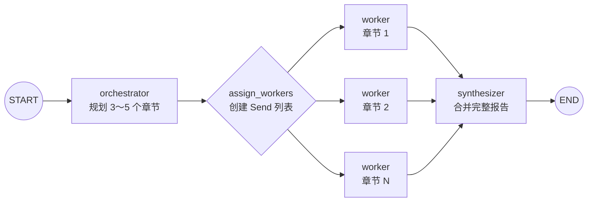

# 06｜LangGraph Orchestrator-Worker：Send 动态并行与 Reducer 汇总

这份笔记用“协调者拆分报告 → 多个工作者并行写章节 → 汇总器合并结果”的例子，学习 LangGraph 的 Orchestrator-Worker 模式。读完后应能理解：**运行时如何动态创建任务、`Send` 如何给每个工作者传递不同状态、Reducer 为什么是并行写入同一字段的关键，以及扇出后的结果怎样重新汇合。**

## 一句话理解

协调者先决定“要做几个子任务”，`Send` 再按计划动态启动多个工作者；工作者各自完成一章，Reducer 收集结果，最后由汇总器组成完整报告。

## 最终流程



这个结构也叫“扇出与扇入”：

```text
一个规划结果
      ↓ 扇出
多个并行工作者
      ↓ 扇入
一个最终报告
```

## 1. 为什么不用固定的并行分支

如果任务永远只有三个章节，可以预先创建三个不同的节点。但本例的章节数量由大模型根据主题决定，可能是三章、四章或五章，构图时并不知道准确数量。

Orchestrator-Worker 适合这种场景：

- 子任务数量要到运行时才能确定。
- 每个子任务执行相同流程，但输入内容不同。
- 所有子任务完成后，需要统一合并结果。

它和普通固定并行的主要区别是：固定并行在构图时就确定分支，而 `Send` 可以在运行时根据状态动态生成工作者任务。

## 2. 协调者如何生成可靠的任务清单

协调者没有让模型自由返回一段文本，而是使用 Pydantic 描述期望结构：

```python
class Section(BaseModel):
    name: str = Field(description="章节标题")
    description: str = Field(description="这一章需要覆盖的核心内容")


class Sections(BaseModel):
    sections: list[Section]


planner = model.with_structured_output(Sections)
```

模型输出会被整理成 `Sections` 对象。协调者因此可以直接读取：

```python
result.sections
```

列表中的每一项都是一个 `Section`，包含章节名和内容要求。相比自己从普通字符串中切割章节，这种结构更清晰，也更不容易因为模型格式变化而解析失败。

结构化输出依赖模型服务的支持。若所用模型或兼容接口不支持，应更换模型，或使用输出解析器并增加校验与重试。

## 3. 主图状态与工作者局部状态

主图状态保存整个工作流需要的数据：

```python
class State(InputState, OutputState):
    sections: list[Section]
    completed_sections: Annotated[list[CompletedSection], operator.add]
```

工作者只需要知道“自己写哪一章”，因此使用单独的局部状态：

```python
class WorkerState(TypedDict):
    section: Section
    section_index: int
```

两种状态的职责不同：

| 状态 | 使用者 | 主要内容 |
| --- | --- | --- |
| `State` | 协调者、调度函数、汇总器 | 主题、全部章节、全部结果、最终报告 |
| `WorkerState` | 单个工作者 | 当前章节和原始顺序 |

这样可以避免每个工作者接收无关的全局数据，也解释了原始代码中为什么能读取 `state["section"]`：这个字段不是从主图状态自然产生的，而是由 `Send` 专门传进来的。

## 4. Send：在运行时创建工作者任务

协调者完成后，条件边调用 `assign_workers()`：

```python
def assign_workers(state: State) -> list[Send]:
    return [
        Send(
            "worker",
            {
                "section": section,
                "section_index": index,
            },
        )
        for index, section in enumerate(state["sections"])
    ]
```

每个 `Send` 包含两部分：

```text
Send(目标节点名称, 传给该节点的状态)
```

假设协调者规划了四章，函数就返回四个 `Send` 对象。LangGraph 会为同一个 `worker` 节点安排四个任务，每个任务收到不同的 `section` 与 `section_index`。

因此这里只需要编写一个通用工作者函数，不必提前创建 `worker_1`、`worker_2`、`worker_3` 等重复节点。

## 5. 为什么这是条件边

图中使用：

```python
builder.add_conditional_edges(
    "orchestrator",
    assign_workers,
    ["worker"],
)
```

普通边只能指定一个固定的下一节点。条件边会先执行路由函数，再根据返回值决定下一步。

常见路由函数返回一个节点名，例如：

```python
return "worker"
```

本例返回的是 `Send` 对象列表，因此它不只是选择路径，还为每条动态路径携带各自的输入状态。

第三个参数 `["worker"]` 告诉图构建器可能到达的节点，有助于图结构展示与类型分析；真正创建多少个工作者任务，仍由运行时的 `Send` 列表决定。

## 6. 工作者只处理自己的章节

工作者从局部状态读取任务：

```python
section = state["section"]
```

然后调用模型，最后返回一个只有一项的列表：

```python
return {
    "completed_sections": [
        {
            "index": state["section_index"],
            "name": section.name,
            "content": result.content,
        }
    ]
}
```

这里必须返回列表，而不是直接返回字典或字符串，因为主状态中的 `completed_sections` 被定义为列表，Reducer 要把各个工作者的列表相加。

## 7. Reducer 为什么不可缺少

多个工作者会并行更新同一个状态字段：

```python
completed_sections: Annotated[
    list[CompletedSection],
    operator.add,
]
```

`Annotated` 的第二个参数告诉 LangGraph 如何合并同一字段的多个更新。这里使用 `operator.add`，效果相当于列表拼接：

```python
[章节一] + [章节二] + [章节三]
```

得到：

```python
[章节一, 章节二, 章节三]
```

如果没有 Reducer，多个并行工作者同时写入 `completed_sections` 时，框架无法判断应该覆盖、保留还是合并，通常会产生并发状态更新错误。

Reducer 只负责“怎么合并”，不会自动检查内容正确性，也不会保证结果列表严格按照任务创建顺序排列。

## 8. 为什么还要保存章节序号

并行任务的完成顺序可能受模型响应时间和网络延迟影响。例如第二章可能最先完成，第一章最后完成。

为了让最终报告仍按原大纲排序，发送任务时保存序号：

```python
"section_index": index
```

汇总时再次排序：

```python
ordered_sections = sorted(
    state["completed_sections"],
    key=lambda item: item["index"],
)
```

这是并行工作流中很实用的工程处理：不要把“完成顺序”误当成“业务顺序”。

## 9. 扇入：汇总器何时执行

每个动态工作者都有一条边通向 `synthesizer`：

```python
builder.add_edge("worker", "synthesizer")
```

LangGraph 会在这一批并行工作者完成并合并状态后，让汇总器读取完整的 `completed_sections`。汇总器按序排列所有章节，再用 Markdown 分隔线连接：

```python
final_report = "\n\n---\n\n".join(...)
```

本例的汇总器不再调用模型，只做确定性的排序与字符串拼接。这样可以减少一次模型调用，并避免汇总时意外删改工作者内容。如果需要统一语气、写摘要或消除重复，也可以让汇总器再调用一次模型。

## 10. 模型调用次数与并行收益

设协调者生成 `N` 个章节：

```text
总模型调用次数 = 1 次规划 + N 次章节生成
```

本例为三到五章，因此总共调用四到六次模型。

工作者可并行执行，所以总体等待时间通常小于把所有章节依次生成的时间之和，但实际并发度还会受到模型服务限流、LangGraph 运行配置和网络环境影响。并行不会减少 token 用量，只是有机会减少等待时间。

## 11. 输入与输出边界

图仍然把公开输入、内部状态和公开输出分开：

```python
builder = StateGraph(
    State,
    input_schema=InputState,
    output_schema=OutputState,
)
```

调用者只需提供：

```python
{"topic": "雅思与托福的区别和备考建议"}
```

最终只收到：

```python
{"final_report": "..."}
```

任务清单和各工作者结果属于内部过程数据，不会成为公开返回值。

## 12. 安装、配置与运行

在仓库根目录安装依赖：

```bash
pip install -r requirements.txt
```

复制环境变量模板：

```bash
# Windows PowerShell
Copy-Item .env.example .env

# macOS / Linux
cp .env.example .env
```

在 `.env` 中填写模型服务密钥，并可选修改报告主题：

```env
OPENAI_API_KEY=你的密钥
OPENAI_BASE_URL=https://openrouter.ai/api/v1
MODEL_NAME=openai/gpt-4o-mini
REPORT_TOPIC=雅思与托福的区别和备考建议
```

运行：

```bash
python langgraph_orchestrator_worker.py
```

程序会先打印协调者规划的章节数，再打印各工作者正在编写的章节，最后输出完整 Markdown 报告。并行执行时，工作者日志的出现顺序不一定等于章节顺序，这是正常现象。

## 13. 原始学习代码中的实用改进

完整示例保留了“协调者 → 工作者 → 汇总器”的核心思路，并做了这些整理：

1. 还原复制过程中产生的反斜杠、HTML 实体和 Markdown 链接。
2. 把 `base_url` 修复为普通 URL，并用 `.env` 管理配置与密钥。
3. 增加 `InputState`、`OutputState` 和独立 `WorkerState`，明确公开接口与局部任务数据。
4. 为 `sections`、`completed_sections` 增加具体元素类型，方便阅读和类型检查。
5. 用描述性节点名代替 `worker_1`，因为一个通用节点会被动态执行多次。
6. 给每章附加序号，并在汇总时排序，避免并行完成顺序影响报告结构。
7. 让汇总器生成带标题和分隔线的 Markdown 报告。
8. 使用 `if __name__ == "__main__"`，导入模块时不会自动请求模型。

## 14. 常见错误

### 在主 State 中找不到 section

`section` 是通过 `Send` 传给工作者的局部字段，不是协调者返回的全局字段。应为工作者定义 `WorkerState`，并保证 `Send` 的字典包含同名键。

### 并行写入时报状态更新冲突

如果多个工作者都返回 `completed_sections`，该字段就需要 Reducer：

```python
completed_sections: Annotated[list, operator.add]
```

### 工作者返回的不是列表

错误：

```python
return {"completed_sections": result.content}
```

正确：

```python
return {"completed_sections": [result.content]}
```

Reducer 两侧的数据结构必须与状态定义一致。本仓库的完整示例还在每项中保存了序号、标题和正文。

### Send 的节点名写错

`Send("worker", ...)` 中的名称必须与注册节点一致：

```python
builder.add_node("worker", worker)
```

### 误以为工作者数量在构图时确定

图中只有一个名为 `worker` 的节点定义。运行时有几个章节，就会由 `Send` 生成几个该节点的任务。

### 最终章节顺序变化

并行任务可能乱序完成。为任务保存索引，并在汇总器中排序，不要依赖列表合并时的偶然顺序。

### 结构化输出失败

先确认当前模型和服务支持结构化输出，并检查 Pydantic Schema 是否过于复杂。生产环境还应为校验失败、限流和网络错误增加重试策略。

### URL 被复制成 Markdown 链接

错误：

```python
base_url="[https://openrouter.ai/api/v1](https://openrouter.ai/api/v1)"
```

正确：

```python
base_url="https://openrouter.ai/api/v1"
```

## 15. 复习问答

<details>
<summary>1. Orchestrator-Worker 模式解决什么问题？</summary>

它让协调者在运行时把复杂任务拆成数量不固定的子任务，交给多个工作者处理，再把结果统一汇总。

</details>

<details>
<summary>2. 一个 Send 对象包含什么？</summary>

目标节点名称，以及要单独传给该节点实例的状态。

</details>

<details>
<summary>3. 为什么只定义一个 worker 节点也能处理多个章节？</summary>

`assign_workers()` 会为每个章节返回一个指向同一节点的 `Send`。LangGraph 在运行时多次调度该节点，每次传入不同的局部状态。

</details>

<details>
<summary>4. completed_sections 为什么要使用 operator.add？</summary>

多个工作者会并行更新同一个列表字段。`operator.add` 告诉 LangGraph 把各自返回的列表拼接起来，而不是让更新互相冲突。

</details>

<details>
<summary>5. WorkerState 与 State 有什么区别？</summary>

`State` 是主图共享的完整状态；`WorkerState` 只描述 `Send` 传给某个工作者的局部任务数据。

</details>

<details>
<summary>6. 为什么合并前还要排序？</summary>

并行任务的完成顺序不稳定。保存原始章节索引并排序，才能保证最终报告符合协调者的大纲顺序。

</details>

<details>
<summary>7. 三个章节会调用模型几次？</summary>

一次协调者规划加三次工作者生成，共四次。本例汇总器只拼接文本，不调用模型。

</details>

<details>
<summary>8. 固定边与 Send 的核心区别是什么？</summary>

固定边在构图时确定一个后续路径；`Send` 可以在运行时根据状态创建数量不固定、且携带不同输入的节点任务。

</details>

## 16. 可以继续练习

- 使用 `report_workflow.stream()` 观察协调者、各工作者和汇总器的状态更新。
- 为每个工作者增加资料检索工具，让章节内容基于外部来源生成。
- 给汇总器增加模型调用，统一全文语气并生成摘要。
- 限制最大并发数，观察执行时间和服务限流的变化。
- 为失败的章节增加重试和错误记录，而不是让整份报告直接失败。
- 根据章节类型把任务分配给不同节点，例如数据分析、案例研究和总结节点。
- 增加人工审核，让用户修改大纲后再启动工作者。

## 官方资料

- [LangGraph Workflows and Agents：Orchestrator-Worker](https://docs.langchain.com/oss/python/langgraph/workflows-agents#orchestrator-worker)
- [LangGraph Send API 参考](https://reference.langchain.com/python/langgraph/types/Send)

## 完整源码

见 [`langgraph_orchestrator_worker.py`](../langgraph_orchestrator_worker.py)。
