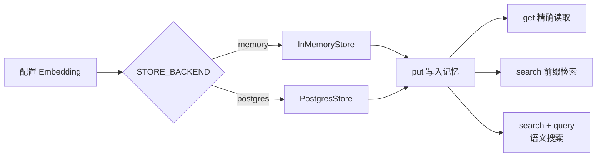

# 08｜LangGraph 长期记忆 Store：命名空间、PostgreSQL 与语义搜索

这份笔记学习 LangGraph Store 的基础用法：怎样保存用户长期偏好、用命名空间隔离数据、通过 `get()` 精确读取、通过 `search()` 按范围检索，以及如何为 `InMemoryStore` 和 `PostgresStore` 加入语义搜索。

## 一句话理解

Store 是 Agent 的长期记忆仓库：程序使用 `namespace + key` 定位一条记忆，使用命名空间前缀查找一组记忆，还可以借助 Embedding 按语义找出与问题最相关的内容。

## 最终流程



## 1. Store 解决什么问题

Agent 经常需要记住超出单次会话的内容，例如：

- 用户喜欢的食物、音乐和回答语言。
- 某个客户长期有效的业务资料。
- 多个对话线程都要访问的个人设置。
- 可以被自然语言召回的经验和事实。

这些信息不适合一直塞进图状态。Store 提供独立的键值存储接口，并允许应用用用户 ID、组织 ID 或业务分类构建自己的数据层级。

## 2. Store 与 Checkpointer 的区别

上一节使用 `PostgresSaver` 保存图状态，本节使用 `PostgresStore` 保存应用数据。两者虽然都可以使用 PostgreSQL，但职责不同：

| 对比项 | Checkpointer | Store |
| --- | --- | --- |
| 保存内容 | 图执行状态和消息快照 | 应用定义的长期数据 |
| 主要定位方式 | `thread_id`、`checkpoint_id` | `namespace`、`key` |
| 默认范围 | 一条执行线程 | 可跨线程共享 |
| 典型能力 | 暂停恢复、历史、Replay、Fork | 用户偏好、长期事实、语义搜索 |
| PostgreSQL 实现 | `PostgresSaver` | `PostgresStore` |

原始代码同时创建了 `PostgresSaver` 和 `PostgresStore`，但没有编译或运行 LangGraph 图，因此 Checkpointer 实际没有被使用。完整示例删除了无效的 `PostgresSaver`，让学习重点保持在 Store。

## 3. 一条记忆由什么组成

写入方法的核心参数是：

```python
store.put(
    namespace=("user_123", "preferences", "food"),
    key="favorite-food",
    value={"text": "用户喜欢吃披萨。"},
)
```

可以把它想成：

```text
namespace：文件夹路径
key：文件名
value：文件内容
```

`namespace + key` 共同组成唯一地址。在同一个命名空间中用同一个 key 再次调用 `put()`，会更新原来的条目；若希望每次都新增一条，可以使用 UUID 作为 key。

## 4. namespace：分层组织与数据隔离

命名空间是字符串元组：

```python
food_namespace = (user_id, "preferences", "food")
music_namespace = (user_id, "preferences", "music")
```

每个元素代表一级层次。常见设计包括：

```text
(user_id, "preferences", category)
(organization_id, "knowledge", document_type)
(assistant_id, user_id, "memories")
```

把 `user_id` 放进命名空间可以隔离不同用户，但这只是数据组织方式，不等于权限系统。生产环境必须从已经验证的身份中取得用户 ID，并在服务端强制限制允许访问的命名空间，不能直接相信客户端传入的任意 ID。

## 5. key 为什么使用稳定名称

原始代码使用随机 UUID：

```python
memory_id = str(uuid.uuid4())
```

UUID 适合“每次写入都新增一条”的事件型记忆。这个示例保存的是“最喜欢的食物”一类单值偏好，因此改用稳定 key：

```python
key="favorite-food"
```

这样重复运行程序不会不断生成相同演示数据，还能自然演示 `put()` 的更新语义。

选择原则：

- 一个槽位只保留当前值：使用稳定业务 key。
- 每次都要保留独立记录：使用 UUID 或业务事件 ID。

## 6. value 应该怎样设计

Store 的 value 是具有字符串键、且可以序列化的字典：

```python
{
    "text": "用户喜欢周杰伦的中文歌曲《夜曲》。",
    "category": "music",
    "source": "demo",
}
```

示例把适合语义检索的自然语言放在 `text` 字段，把结构化信息放在其他字段。这样既便于 Embedding，也能使用 `filter` 做精确筛选。

不要直接保存密码、访问令牌或不必要的敏感信息。真正的长期记忆还应考虑用户同意、数据删除、保留期限和访问审计。

## 7. InMemoryStore：适合快速学习

```python
store = InMemoryStore(index=index_config)
```

它不需要数据库，适合测试 API 和理解概念；但数据只存在当前 Python 进程中，程序结束后会丢失。

示例默认使用：

```env
STORE_BACKEND=memory
```

这样初次运行无需准备 PostgreSQL。切换为 `postgres` 后，同一份演示逻辑会改用持久化 Store。

## 8. PostgresStore：把长期记忆持久化

```python
with PostgresStore.from_conn_string(
    postgres_uri,
    index=index_config,
) as store:
    store.setup()
```

`setup()` 会创建所需表并执行迁移，首次使用必须调用。示例每次启动都调用，以便自动检查尚未执行的迁移。

开启向量搜索时，PostgreSQL 还需要可用的 `pgvector` 扩展。如果数据库没有安装或不允许启用该扩展，普通键值操作可以改用不带 `index` 的 Store，但语义搜索无法工作。

数据库连接串从环境变量读取：

```env
POSTGRES_URI=postgresql://用户名:密码@主机:5432/数据库名
```

不要把真实密码写进源码或提交到公开仓库。

## 9. Embedding 与索引配置

```python
index_config = {
    "embed": embeddings,
    "dims": 1536,
    "fields": ["text"],
}
```

三个字段的含义：

| 字段 | 作用 |
| --- | --- |
| `embed` | 把文本转换为向量的 Embedding 实例 |
| `dims` | 每个向量的维度 |
| `fields` | 从 value 中选择要嵌入的字段 |

示例只索引 `text`，不会把 `category`、`source` 等元数据混进语义向量。

`dims` 必须与模型真实返回的向量长度一致。默认 `text-embedding-3-small` 使用 1536 维；更换模型或自定义维度时，要同步修改 `STORE_EMBEDDING_DIMS`。已有 PostgreSQL 向量表也可能需要迁移或重建索引。

## 10. init_embeddings

示例使用统一初始化函数：

```python
embeddings = init_embeddings(
    model=f"openai:{STORE_EMBEDDING_MODEL}",
    base_url=OPENAI_BASE_URL,
    check_embedding_ctx_length=False,
)
```

`openai:` 表示使用 `langchain-openai` 集成。`base_url` 允许连接兼容 OpenAI Embeddings API 的服务。不同兼容服务支持的模型和参数可能不同，运行前应确认服务确实提供所配置的 Embedding 模型。

如果直接使用官方 OpenAI，可以把 `OPENAI_BASE_URL` 设置为官方端点，或按集成文档省略自定义地址。

## 11. put：写入或更新记忆

```python
store.put(namespace, key, value)
```

当 Store 初始化时提供了 `index` 配置，默认会按照 `fields` 对新条目建立向量索引。

单条记忆也可以跳过索引：

```python
store.put(namespace, key, value, index=False)
```

它仍能被 `get()` 和不带语义 query 的 `search()` 找到，只是没有用于相似度搜索的向量。

## 12. get：按完整地址精确读取

```python
item = store.get(
    namespace=(USER_ID, "preferences", "food"),
    key="favorite-food",
)
```

`get()` 适合程序已经知道完整 namespace 和 key 的场景。找到时返回 Item，常用属性包括：

- `namespace`：条目所在的完整命名空间。
- `key`：条目 key。
- `value`：保存的字典。
- `created_at`、`updated_at`：实现支持的创建与更新时间。

找不到时返回 `None`，所以正式代码应先判断结果。

## 13. search：按命名空间前缀检索

```python
items = store.search((USER_ID, "preferences"))
```

这里传入的是命名空间前缀，因此可以同时找到：

```text
(user_id, "preferences", "food")
(user_id, "preferences", "music")
```

而 `(user_id, "profile")` 不匹配这个前缀，不会被返回。

还可以使用 `limit`、`offset` 分页，或使用 `filter` 按 value 中的结构化字段筛选。

## 14. 语义搜索

```python
items = store.search(
    (USER_ID, "preferences"),
    query="用户喜欢的中国音乐",
    limit=2,
)
```

语义搜索不是字面关键词匹配。查询“用户喜欢的中国音乐”，仍然可以召回“用户喜欢周杰伦的中文歌曲《夜曲》”，因为它们的向量含义接近。

返回的 `SearchItem` 除了普通条目字段外，还可能带有 `score`。分数适合用来排序，但不同模型、距离策略和 Store 实现的分值范围不应直接混用，也不应随意把固定阈值从一个模型搬到另一个模型。

## 15. 为什么语义搜索必须显式配置 index

`InMemoryStore()` 或 `PostgresStore()` 默认只提供普通存储能力。只有在创建 Store 时传入：

```python
index={"embed": ..., "dims": ..., "fields": ...}
```

语义搜索才会启用。没有这个配置时，`put()` 的 `index` 参数不会产生向量，带自然语言 query 的检索也无法正常完成预期工作。

## 16. 配置与运行

安装依赖：

```bash
pip install -r requirements.txt
```

复制环境变量模板并填写自己的 Embedding API Key：

```bash
# Windows PowerShell
Copy-Item .env.example .env

# macOS / Linux
cp .env.example .env
```

先运行内存模式：

```env
STORE_BACKEND=memory
OPENAI_API_KEY=你的密钥
STORE_EMBEDDING_MODEL=text-embedding-3-small
STORE_EMBEDDING_DIMS=1536
```

```bash
python langgraph_long_term_memory_store.py
```

切换 PostgreSQL：

```env
STORE_BACKEND=postgres
POSTGRES_URI=postgresql://用户名:密码@127.0.0.1:5432/数据库名
```

数据库需要提供 `pgvector` 扩展，Embedding 模型的输出维度还必须与配置一致。

## 17. 预期输出

不同 Store 的元数据和相似度分数可能不同，结构大致如下：

```text
当前 Store：memory

精确读取：namespace=('user_123', 'preferences', 'food'), key=favorite-food, ...

用户偏好（命名空间前缀检索）：
- 记忆：... 用户喜欢吃披萨。
- 记忆：... 用户喜欢周杰伦的中文歌曲《夜曲》。

语义搜索：'用户喜欢的中国音乐'
- 相似度=...：...《夜曲》。
```

语义结果的顺序由模型生成的向量决定，不应把示例分数当作固定测试值。

## 18. 原始学习代码中的实用改进

1. 删除硬编码的 PostgreSQL 密码，统一改用 `.env`。
2. 删除没有被图使用的 `PostgresSaver`，避免混淆 Checkpointer 与 Store。
3. 同一份代码支持 `InMemoryStore` 和 `PostgresStore` 两种后端。
4. 恢复并整理完整的写入、读取、前缀检索和语义搜索流程。
5. 使用稳定 key，避免每次演示都重复插入相同偏好。
6. 把可检索文本放在 `text` 字段，只对该字段建立向量。
7. 把 Embedding 模型、维度、查询、用户 ID 和数据库地址改为环境变量。
8. 对非法 Store 类型和缺少数据库连接串提供明确错误。
9. 使用上下文管理器关闭 PostgreSQL Store 连接。
10. 增加主入口保护，导入模块时不会写数据库或请求 Embedding API。

## 19. 常见错误

### PostgreSQL 密码出现在源码或提交记录中

立即更换已经暴露的密码，并把连接串移入未提交的 `.env`。仅仅删除最新文件不能清除历史提交中的秘密。

### ModuleNotFoundError: langgraph.store.postgres

安装 PostgreSQL 扩展包：

```bash
pip install langgraph-checkpoint-postgres "psycopg[binary]"
```

### PostgreSQL 提示 vector 类型或扩展不存在

语义搜索依赖 `pgvector`。确认数据库服务已安装并允许使用该扩展，再执行 `store.setup()`。

### 向量维度不一致

`STORE_EMBEDDING_DIMS` 必须等于 Embedding 模型实际返回的维度。更换模型后同步修改配置，并检查已有索引结构。

### 401 或模型不存在

检查 API Key、`OPENAI_BASE_URL` 和 `STORE_EMBEDDING_MODEL`。OpenAI 兼容服务不一定提供所有 OpenAI 模型。

### get() 返回 None

检查 namespace 的每一层和 key 是否完全一致。精确读取不会自动搜索相近的命名空间。

### search() 没有找到子分类

确认传入的是命名空间前缀，例如 `(user_id, "preferences")`，而不是其他用户或其他分支。

### 语义搜索结果不理想

检查被索引的字段是否包含有意义的自然语言；尝试改进记忆文本、查询表达、模型或 `limit`，不要只依赖很短的标签。

### memory 模式重启后数据消失

这是 `InMemoryStore` 的预期行为。需要跨进程保留数据时切换到数据库后端。

## 20. 复习问答

<details>
<summary>1. Store 和 Checkpointer 的主要区别是什么？</summary>

Checkpointer 保存某条线程的图执行状态；Store 保存应用定义的长期数据，并可通过命名空间供多个线程共享。

</details>

<details>
<summary>2. 什么共同决定一条 Store 记忆的唯一地址？</summary>

完整的 `namespace` 和 `key`。

</details>

<details>
<summary>3. namespace 为什么使用元组？</summary>

元组中的每个字符串代表一层路径，便于按用户、业务和分类分层组织，并支持前缀检索。

</details>

<details>
<summary>4. put 相同 namespace 和 key 会怎样？</summary>

更新原有条目，而不是新增另一个同地址条目。

</details>

<details>
<summary>5. get 与 search 的使用场景有什么不同？</summary>

`get()` 用完整 namespace 和 key 精确读取一条；`search()` 在命名空间前缀下查找多条，还可使用过滤、分页和语义 query。

</details>

<details>
<summary>6. 为什么语义搜索需要 Embedding？</summary>

Embedding 把查询和记忆文本转换为向量，Store 才能依据向量距离比较它们的语义相似程度。

</details>

<details>
<summary>7. fields=["text"] 有什么作用？</summary>

它只把 value 的 `text` 字段用于向量索引，避免无关元数据影响语义表示。

</details>

<details>
<summary>8. InMemoryStore 适合生产长期记忆吗？</summary>

通常不适合。它适合学习和测试，进程结束后数据会丢失；持久化场景应选择数据库后端。

</details>

<details>
<summary>9. 把 user_id 放进 namespace 是否已经完成权限隔离？</summary>

没有。它只组织数据；服务端还必须验证身份并强制限定用户可以访问的命名空间。

</details>

## 21. 可以继续练习

- 修改同一个 `favorite-food`，验证 `put()` 更新的是旧条目。
- 增加第二个用户，确认前缀检索不会混入另一个用户的记忆。
- 用 UUID 保存多条“旅行经历”，比较事件型记忆与槽位型偏好。
- 给 value 增加 `importance`，使用 `filter` 只查高优先级记忆。
- 使用 `index=False` 写入一条不参与语义搜索的内部元数据。
- 把 Store 注入 LangGraph 节点，让 Agent 在回答前召回用户偏好。
- 为用户提供列出、修改和删除长期记忆的界面。
- 研究 TTL、批量操作和异步 `AsyncPostgresStore`。

## 官方资料

- [LangGraph Store 基础类型](https://reference.langchain.com/python/langgraph.store/base)
- [InMemoryStore API](https://reference.langchain.com/python/langgraph.store/memory/InMemoryStore)
- [PostgresStore API](https://reference.langchain.com/python/langgraph.store.postgres/base/PostgresStore)
- [Store put API](https://reference.langchain.com/python/langgraph.store/base/BaseStore/put)
- [Store search API](https://reference.langchain.com/python/langgraph.store/base/BaseStore/search)
- [LangChain init_embeddings](https://reference.langchain.com/python/langchain/embeddings/base/init_embeddings)
- [OpenAIEmbeddings 配置](https://reference.langchain.com/python/langchain-openai/embeddings/base/OpenAIEmbeddings)

## 完整源码

见 [`langgraph_long_term_memory_store.py`](../langgraph_long_term_memory_store.py)。
