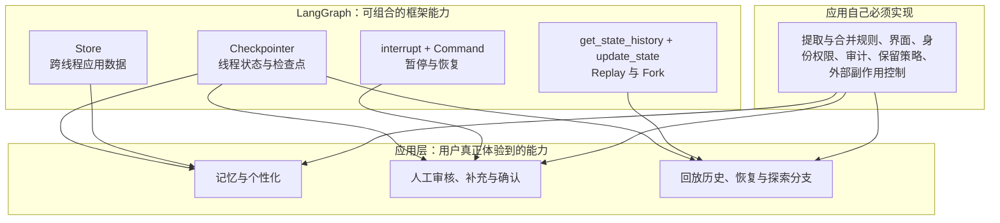
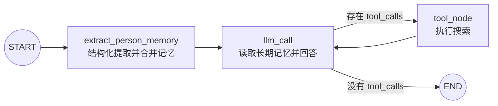
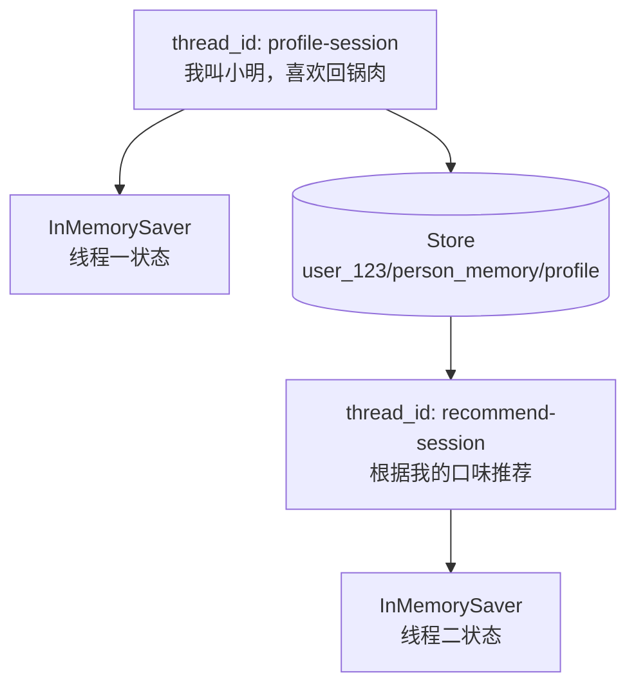

# 09｜LangGraph 跨线程个性化 Agent：结构化提取、Runtime 与长期记忆

上一节学习了 Store 的基础读写；这一节把 Store 真正接入 LangGraph Agent。系统会从用户消息中结构化提取个人资料，合并到长期记忆，并在另一个全新的对话线程中读取这些信息，生成个性化回答。

读完后应能理解：**应用能力与 LangGraph 框架能力的边界、`thread_id` 与 `user_id` 为什么不能混为一谈、Store 如何注入节点、怎样避免空值覆盖旧记忆，以及长期记忆如何进入模型上下文。**

## 一句话理解

Checkpointer 用 `thread_id` 记住一段对话，Store 用 `user_id` 记住一个人；当同一用户开始新线程时，聊天记录可以是空的，但 Agent 仍能读取其长期偏好。

## 先分清：应用能力不等于 LangGraph 框架能力

图片中的分层方向是正确的：**记忆、人机交互、时间旅行最终都是应用向用户呈现的能力，不能简单归功于一个框架。** 不过，“LangGraph 只提供持久化”又过度简化了它的职责。更准确的公式是：

> 应用能力 = LangGraph 原语 + 业务规则 + 模型或外部服务 + 产品界面 + 安全治理



| 面向用户的应用能力 | LangGraph 提供的机制 | 应用仍然负责什么 |
| --- | --- | --- |
| 记住当前对话 | Checkpointer 按 `thread_id` 保存图状态和消息 | 上下文裁剪、摘要策略、展示与清除入口 |
| 跨会话个性化 | Store、namespace、Runtime Store 注入 | 提取哪些事实、如何合并、何时过期、用户授权与权限隔离 |
| 人机交互 / Human-in-the-loop | `interrupt()` 暂停，Checkpointer 保存现场，`Command(resume=...)` 恢复 | 何时要求审核、审核界面、身份校验、超时和审计 |
| 时间旅行 | 检查点、`get_state_history()`、从旧配置 Replay、`update_state()` Fork | 让用户选择哪个版本、标注分支、处理重复 API 调用等外部副作用 |

需要特别记住四条边界：

1. **LangGraph 不会自动决定“什么值得记住”。** Store 只保存应用写进去的数据；提取、校验、合并和删除策略属于业务代码。
2. **LangGraph 不会自动生成审核界面。** 它可以暂停和恢复执行，应用需要把 interrupt 的内容展示给人，并把人的决定安全地传回去。
3. **时间旅行不是数据库整体回滚。** Replay 会重新执行检查点之后的节点，模型调用、搜索、发邮件或付款等副作用可能再次发生，应用必须保证幂等或增加审批。
4. **持久化不一定等于永久保存。** `InMemorySaver` 和 `InMemoryStore` 在进程退出后会丢失；生产环境要换成数据库后端并配置保留策略。

因此，本例展示的“跨线程记住用户口味”是应用能力；LangGraph 在底层提供 Store、Checkpointer 和 Runtime 注入，而“提取口味、合并旧档案、限制访问、把记忆放进提示词”都是本例的应用逻辑。

## 最终流程



两个线程与一份 Store 的关系：



## 1. 这个示例解决什么问题

普通会话记忆只在一条线程中有效。用户关闭聊天窗口并新建会话后，新线程没有旧消息，Agent 就不知道用户之前说过什么。

长期记忆的目标是保存跨对话仍有价值的事实，例如：

- 姓名、语言偏好等个人设置。
- 喜欢或不喜欢的食物。
- 长期目标和稳定约束。
- 经用户同意保存的常用信息。

本例第一次对话提取“小明、1.75 米、喜欢回锅肉”，第二次使用不同的 `thread_id` 询问推荐。模型看不到第一条线程的消息，却能通过 Store 读取这些偏好。

## 2. thread_id 与 user_id

两种 ID 分别回答不同问题：

| ID | 回答的问题 | 在本例中的用途 |
| --- | --- | --- |
| `thread_id` | 这是哪一段执行或对话？ | Checkpointer 隔离线程消息 |
| `user_id` | 当前请求属于哪一名用户？ | Store 隔离长期记忆 |

示例使用两个线程：

```python
first_config = {"configurable": {"thread_id": "profile-session"}}
second_config = {"configurable": {"thread_id": "recommend-session"}}
```

但两次运行都传入相同上下文：

```python
context = UserContext(user_id="user_123")
```

因此线程状态互不相同，长期记忆命名空间却相同。

## 3. 为什么 user_id 放在 Runtime Context

当前 LangGraph API 支持为图定义运行时上下文：

```python
@dataclass(frozen=True)
class UserContext:
    user_id: str

builder = StateGraph(MessagesState, context_schema=UserContext)
```

节点通过 `Runtime` 读取：

```python
def llm_call(state, runtime: Runtime[UserContext]):
    user_id = runtime.context.user_id
```

`user_id` 是本次运行的依赖信息，不是节点逐步修改的业务状态，因此放入 Context 比塞进 `MessagesState` 更清晰。`thread_id` 仍属于 Checkpointer 的可配置参数，继续放在 `config` 中。

原始代码把两个 ID 都放在 `configurable` 中也能表达概念，但会让“线程定位参数”和“应用上下文”混在一起。完整示例采用 `context_schema + Runtime`，更容易在后续加入租户 ID、权限或数据库连接等运行依赖。

## 4. Runtime 如何提供 Store

编译图时传入 Store：

```python
agent = builder.compile(
    checkpointer=InMemorySaver(),
    store=store,
)
```

LangGraph 会在运行节点时提供 `Runtime`：

```python
def extract_person_memory(state, runtime: Runtime[UserContext]):
    store = runtime.store
```

示例用 `require_store()` 显式检查：

```python
if runtime.store is None:
    raise RuntimeError("图没有配置 Store")
```

这样忘记在 `compile()` 中传入 Store 时，错误信息比后续的 `NoneType` 异常更容易理解。

也可以在节点中调用 `langgraph.config.get_store()` 取得当前 Store；本例使用 Runtime，是因为它同时承载了类型化用户上下文。

## 5. 状态为什么使用 add_messages

```python
class MessagesState(TypedDict):
    messages: Annotated[list[AnyMessage], add_messages]
    llm_calls: NotRequired[int]
```

`add_messages` 是消息专用 Reducer：通常追加新消息，遇到相同消息 ID 时则更新原消息，还能规范化常见的消息输入表示。

原始代码使用 `operator.add`，它只负责列表拼接。简单演示可能可用，但无法利用消息 ID 更新语义，也更容易在复杂持久化流程中出现重复消息。

`llm_calls` 没有 Reducer，节点返回的新整数会覆盖旧整数。

## 6. 使用 Pydantic 定义记忆 Schema

```python
class PersonMemory(BaseModel):
    name: str | None
    height_meters: float | None
    favorite_foods: list[str] | None
```

结构化输出比让模型返回任意文本更适合存储：

- 字段名称稳定，程序容易校验和合并。
- 缺失字段可以明确表示为 `None`。
- 身高使用数字，便于后续计算和验证。
- 食物使用列表，支持合并多项偏好。

模型通过：

```python
memory_extractor = model.with_structured_output(PersonMemory)
```

返回经过 Pydantic 校验的对象。

## 7. 只从最新 HumanMessage 提取

原始代码把最近三条消息全部交给提取器：

```python
state["messages"][-3:]
```

这些消息可能包含 AI 回答或搜索工具结果。提取器可能误把网页内容、餐厅介绍或助手的话当成用户资料。

完整示例从后向前寻找最近的 `HumanMessage`：

```python
for message in reversed(state["messages"]):
    if isinstance(message, HumanMessage):
        return message
```

系统提示还要求：只提取用户明确描述的本人信息，不推测，不提取他人的资料。代码过滤和提示词约束要同时使用，不能只依赖其中一种。

## 8. 热路径中的结构化提取

本例在回答前同步执行一次提取：

```text
用户输入 → 提取记忆 → 保存 Store → 生成回答
```

这是“热路径”写入：本轮回答立刻能看到刚保存的信息，流程也容易理解。代价是每次请求增加一次模型调用和等待时间。

生产系统还可以采用“后台路径”：先回答，再通过异步任务提取长期记忆。它延迟更低，但需要处理队列、失败重试和最终一致性。

## 9. 为什么工具循环不能再次进入提取节点

原始图使用：

```text
tool_node → get_person_by_llm → llm_call
```

如果模型多次调用工具，提取器会反复执行，并读取混有 ToolMessage 的状态；这不仅浪费模型调用，还可能写入空记录或错误记忆。

完整示例改为：

```text
START → extract_person_memory → llm_call
                           ↑          ↓
                           └─ 不回到这里  tool_node
                                      ↓
                                  llm_call
```

工具执行完成后直接返回 `llm_call`。每次 `invoke()` 只提取一次记忆，而模型与工具仍可正常循环。

## 10. namespace 与稳定 key

示例地址为：

```python
namespace = (user_id, "person_memory")
key = "profile"
```

组合后的逻辑路径是：

```text
user_123 / person_memory / profile
```

原始代码每次写入都生成 UUID。对于“当前个人档案”这种槽位型记忆，随机 key 会不断产生重复记录；之后 `search(limit=1)` 也不保证返回你期待的最新资料。

稳定 key 会让 `put()` 更新同一条档案。UUID 更适合需要保留每个独立事件的记忆，例如旅行经历、订单或会议记录。

## 11. 合并，而不是直接覆盖

第二次消息只是“给我推荐”，结构化提取的字段大多是 `None`。如果直接写入，会把第一次保存的姓名和偏好清空。

完整示例先读取旧值：

```python
current_item = store.get(namespace, "profile")
```

再按规则合并：

- 新的非空姓名覆盖旧姓名。
- 新的非空身高覆盖旧身高。
- 新食物与旧食物合并并去重。
- 本轮没有任何信息时不创建空记录。

食物去重使用：

```python
list(dict.fromkeys([*existing_foods, *new_foods]))
```

它既去重，又保留原始顺序。

## 12. 记忆更新仍需要业务规则

当前合并规则适合入门，但不是通用答案。例如用户说“我不再喜欢回锅肉”，现有 Schema 只会提取喜欢的食物，无法表达删除。

更完整的系统可以让提取器输出操作：

```text
add     新增事实
update  修改事实
delete  删除或忘记事实
ignore  不保存
```

对于冲突信息，还应记录来源、时间、置信度和用户确认状态，而不是让模型默默覆盖高价值资料。

## 13. 把记忆注入模型上下文

回答节点精确读取档案：

```python
person_memory = load_person_memory(store, user_id)
```

再序列化为清晰的 JSON：

```python
memory_text = json.dumps(person_memory, ensure_ascii=False)
```

它被放入 SystemMessage，并明确要求“仅在与当前问题有关时参考”。这样用户问菜品时可以使用食物偏好，问无关问题时不会生硬地重复姓名或身高。

长期记忆是模型上下文的一部分，不是绝对可信事实。应用应区分用户声明、系统验证数据和模型推断，并在高风险决策中使用权威数据源。

## 14. Checkpointer 与 Store 同时工作

```python
builder.compile(
    checkpointer=InMemorySaver(),
    store=InMemoryStore(),
)
```

二者并不重复：

| 组件 | 本例中保存什么 | 隔离键 |
| --- | --- | --- |
| `InMemorySaver` | 每条线程的消息状态 | `thread_id` |
| `InMemoryStore` | 用户个人档案 | `user_id` 命名空间 |

第二个线程没有第一个线程的消息，却能访问相同用户的 Store。这正是“跨线程长期记忆”。

## 15. 为什么本例仍不具备进程重启持久化

“跨线程”不等于“跨进程”。本例的 Saver 和 Store 都在内存中：

- 同一 Python 进程中，新线程可以复用 Store。
- 程序退出后，线程状态和长期记忆都会消失。

需要重启后恢复时，可以把它们替换为数据库实现，例如 `PostgresSaver` 与 `PostgresStore`。第 07、08 篇笔记分别介绍了 PostgreSQL Checkpointer 和 Store。

## 16. 配置与运行

安装依赖：

```bash
pip install -r requirements.txt
```

复制配置模板：

```bash
# Windows PowerShell
Copy-Item .env.example .env

# macOS / Linux
cp .env.example .env
```

至少填写模型和 Tavily 密钥：

```env
OPENAI_API_KEY=你的模型服务密钥
TAVILY_API_KEY=你的 Tavily 密钥
```

可修改演示数据：

```env
LONG_TERM_USER_ID=user_123
PERSONALIZATION_THREAD_ONE=profile-session
PERSONALIZATION_THREAD_TWO=recommend-session
PERSONALIZATION_FIRST_MESSAGE=我叫小明，身高1.75米，我喜欢川菜里的回锅肉。
PERSONALIZATION_SECOND_MESSAGE=根据我的口味推荐几道菜；如果需要最新餐厅信息，可以搜索。
```

运行：

```bash
python langgraph_cross_thread_personalization.py
```

是否调用 Tavily 由模型根据问题判断；因此工具调用次数并不固定。

## 17. 预期现象

第一次运行会打印类似：

```text
长期记忆更新结果：{
  'name': '小明',
  'height_meters': 1.75,
  'favorite_foods': ['回锅肉']
}
```

第二次调用使用另一个 `thread_id`。它的消息列表不包含第一次对话，但输出仍应结合川菜或回锅肉偏好进行推荐。

模型措辞、结构化提取结果和是否调用搜索工具都可能变化，不应把某次生成文本当作固定测试快照。

## 18. 原始学习代码中的实用改进

1. 使用 `Runtime[UserContext]` 区分用户上下文与线程配置。
2. 使用 `add_messages` 替代普通 `operator.add`。
3. 只从最新 HumanMessage 提取，避免污染记忆。
4. 工具节点执行后直接回到回答节点，避免重复提取。
5. 使用稳定的 `profile` key，避免 UUID 不断生成重复档案。
6. 先读取旧记忆再合并，空值不会清除已知信息。
7. 食物偏好采用追加去重，而不是直接覆盖列表。
8. 精确 `get()` 代替语义不清晰的 `search(limit=1)`。
9. 在没有可保存信息时不写入空记录。
10. 对 Store 缺失、消息类型错误等情况提供明确异常。
11. 工具输出转换为字符串，并保存工具名称与调用 ID。
12. 模型、用户 ID、线程 ID 和演示消息全部支持环境变量。
13. 增加主入口保护，导入模块时不会执行模型或搜索调用。

## 19. 常见错误

### 第二个线程读取不到偏好

确认两个调用使用同一个已编译 Agent 和同一个 Store 实例，并传入相同 `user_id`。若重新创建 `InMemoryStore`，旧记忆就不存在了。

### 换了 thread_id 后聊天记录消失

这是预期行为。不同线程由 Checkpointer 隔离；本例要验证的是 Store 记忆仍能跨线程读取。

### 程序重启后记忆消失

`InMemoryStore` 只在当前进程中保存数据。需要真正持久化时换成 `PostgresStore` 等数据库后端。

### 每次工具调用都会再次提取记忆

检查边是否为 `tool_node → llm_call`，不要让工具节点返回提取节点。

### 旧信息被 None 覆盖

写入前先读取旧值，仅使用新的非空字段更新；无信息时跳过写入。

### Store 中出现很多重复档案

槽位型记忆应使用稳定 key。如果每次都用 UUID，`put()` 会不断新增条目。

### IndexError: list index out of range

不要假定 `search(...)[0]` 一定存在。使用 `get()` 时判断是否为 `None`；使用 `search()` 时先判断结果列表。

### 结构化输出失败

确认模型服务支持 Tool Calling 或结构化输出，并检查 Pydantic Schema 是否过于复杂。必要时记录原始模型响应用于调试。

### 模型错误地保存了他人信息

只传用户本人消息、收紧提取提示词，并在重要场景增加规则校验或人工确认。不要让模型自由读取工具输出后直接写个人档案。

### 不同用户看到彼此记忆

必须从已验证的服务端身份生成 `user_id`，并强制把它加入 namespace。不能信任客户端随意提交的用户 ID。

## 20. 安全与隐私

长期记忆可能包含个人信息，至少应做到：

- 只保存产品功能真正需要的数据。
- 明确告知用户保存了什么、用于什么目的。
- 支持查看、更正、删除和关闭长期记忆。
- 对敏感字段加密并限制访问权限。
- 记录写入来源和审计日志。
- 防止提示注入把网页或工具内容写成用户事实。
- 设置保留期限，避免无限期积累。

本示例使用的是虚构演示信息，不应直接套用于医疗、金融或身份认证等高风险场景。

## 21. 复习问答

<details>
<summary>1. thread_id 和 user_id 分别控制什么？</summary>

`thread_id` 定位 Checkpointer 中的一条会话；`user_id` 用于构造 Store 命名空间，定位某个用户的跨线程长期记忆。

</details>

<details>
<summary>2. 为什么新线程还能记得用户偏好？</summary>

两个线程虽然状态不同，但它们使用相同用户 ID 和同一个 Store，因此会访问同一记忆地址。

</details>

<details>
<summary>3. Runtime 在本例中提供什么？</summary>

它提供类型化的 `UserContext` 和编译图时注入的 Store，使节点不必把这些运行依赖塞进图状态。

</details>

<details>
<summary>4. 为什么只提取最新 HumanMessage？</summary>

避免把 AI 回答、搜索结果或工具输出错误地保存为用户本人信息。

</details>

<details>
<summary>5. 为什么使用稳定 key 而不是 UUID？</summary>

个人档案是一个持续更新的槽位。稳定 key 会更新同一条记录；UUID 会不断创建重复档案。

</details>

<details>
<summary>6. 为什么空字段不能直接写入？</summary>

用户本轮可能没有提供个人信息。直接写入 `None` 会清除已经保存的有效记忆。

</details>

<details>
<summary>7. 为什么工具执行后不再进入提取节点？</summary>

本次用户输入已经提取过；再次提取只会增加成本，并可能把工具内容污染成个人记忆。

</details>

<details>
<summary>8. InMemoryStore 能否跨程序重启？</summary>

不能。它只能在同一进程内跨线程共享；跨重启需要数据库 Store。

</details>

<details>
<summary>9. user_id 放入 namespace 是否已经完成权限控制？</summary>

没有。应用还必须验证身份，并在服务端限制用户只能访问自己的命名空间。

</details>

<details>
<summary>10. “长期记忆”究竟是应用能力还是 LangGraph 能力？</summary>

从用户视角看，“记住我并进行个性化”是应用能力。LangGraph 提供 Checkpointer、Store、namespace 和 Runtime 等基础机制；应用负责决定记什么、怎样提取与合并、何时删除，以及如何获得授权并保护数据。

</details>

## 22. 可以继续练习

- 使用第三个 `thread_id` 询问“我叫什么”，验证跨线程召回。
- 新增第二个 `user_id`，验证用户记忆彼此隔离。
- 连续声明两种喜欢的食物，检查列表是否正确合并去重。
- 扩展 Schema，支持“不喜欢的食物”和饮食禁忌。
- 让提取器输出 `add/update/delete/ignore` 操作。
- 为重要记忆增加用户确认节点，再执行 Store 写入。
- 将 `InMemorySaver` 和 `InMemoryStore` 分别替换为 PostgreSQL 实现。
- 把同步记忆提取改为后台任务，比较延迟与一致性。
- 为长期记忆增加来源、更新时间、置信度和过期策略。

## 官方资料

- [LangGraph Runtime API](https://reference.langchain.com/python/langgraph/runtime/Runtime)
- [Runtime.store](https://reference.langchain.com/python/langgraph/runtime/Runtime/store)
- [get_store API](https://reference.langchain.com/python/langgraph/config/get_store)
- [BaseStore API](https://reference.langchain.com/python/langgraph.store/base/BaseStore)
- [LangGraph Store 基础类型](https://reference.langchain.com/python/langgraph.store/base)
- [InjectedStore API](https://reference.langchain.com/python/langgraph.prebuilt/tool_node/InjectedStore)
- [LangGraph Persistence：Checkpointer 与 Store](https://docs.langchain.com/oss/python/langgraph/persistence)
- [LangGraph Interrupts：暂停与恢复](https://docs.langchain.com/oss/python/langgraph/interrupts)
- [LangGraph Time Travel：Replay 与 Fork](https://docs.langchain.com/oss/python/langgraph/use-time-travel)

## 完整源码

见 [`langgraph_cross_thread_personalization.py`](../langgraph_cross_thread_personalization.py)。
