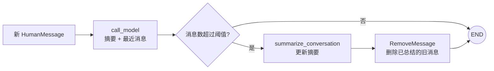

# 10｜LangGraph 短期记忆管理：裁剪、删除、清空与滚动摘要

这一节处理一个很实际的问题：同一条对话线程不断增长时，怎样控制交给模型的上下文和 Checkpointer 中保存的消息，同时尽量保留重要信息。

完整示例提供五种可切换模式：`summary`、`trim`、`delete`、`clear` 和 `overwrite`。读完后应能判断：**哪些操作只影响本次模型调用，哪些操作会永久改变图状态，以及为什么滚动摘要通常比直接删除更能保留语义。**

## 一句话理解

`trim_messages()` 只整理本次交给模型的输入；`RemoveMessage` 和 `Overwrite` 会修改图状态；滚动摘要则先把旧消息压缩成 `summary`，再从消息列表中删除已经总结的部分。

## 默认摘要模式流程



## 1. 为什么要管理短期记忆

Checkpointer 会按 `thread_id` 保存线程状态。聊天应用通常把消息放在 `messages` 字段，因此每一轮用户输入和模型回答都会让列表继续增长。

消息过多会带来几个问题：

- 可能超过模型上下文窗口。
- 输入 Token、延迟和调用费用持续增加。
- 旧内容可能干扰当前任务。
- Checkpoint 体积不断增长。
- 直接删除又可能让模型忘记姓名、偏好或尚未完成的任务。

因此需要在“保留原文”和“控制上下文”之间选择合适策略。

## 2. 先分清三个位置

这是本节最重要的概念：

| 位置 | 保存或使用什么 | 修改后的影响 |
| --- | --- | --- |
| 本次模型输入 | `model.invoke(...)` 收到的临时消息列表 | 只影响这一次模型调用 |
| LangGraph State | 当前线程的 `messages`、`summary` 等字段 | 影响后续节点和后续轮次 |
| Checkpointer | 按 `thread_id` 保存的 State 检查点 | 让线程能够在下一次 `invoke()` 时恢复 |

例如：

```python
trimmed = trim_messages(state["messages"], ...)
result = model.invoke(trimmed)
```

这里只创建了临时变量 `trimmed`，没有把它返回到 `messages`，所以 Checkpointer 中仍然保存完整历史。

而下面的返回值会经过 `add_messages` Reducer，永久删除状态消息：

```python
return {"messages": [RemoveMessage(id=message.id)]}
```

## 3. 五种策略快速对比

| 模式 | 是否减少模型输入 | 是否减少状态消息 | 是否保留旧信息语义 | 典型用途 |
| --- | --- | --- | --- | --- |
| `trim` | 是 | 否 | 只保留裁剪后仍存在的原文 | 想限制 Token，但仍要保存完整线程历史 |
| `delete` | 是 | 是 | 否 | 旧消息确认不再需要 |
| `clear` | 是 | 是，全部删除 | 否 | 会话重置、退出敏感流程 |
| `overwrite` | 是 | 是，直接替换 | 否 | 明确需要绕过 Reducer 写入完整新值 |
| `summary` | 是 | 是 | 是，但可能存在摘要失真 | 长对话中保留核心事实和任务进度 |

默认使用 `summary`，因为它最适合演示“压缩旧消息但仍记得 Bob”。

## 4. MessagesState 为什么能够删除消息

`MessagesState` 的 `messages` 字段使用 `add_messages` Reducer。它不只是普通的列表相加：

- 新 ID 通常表示追加消息。
- 相同 ID 可以更新已有消息。
- `RemoveMessage(id=...)` 可以删除指定消息。
- `RemoveMessage(id=REMOVE_ALL_MESSAGES)` 可以清空消息。

因此，`RemoveMessage` 只能用于带有 `add_messages` 语义的消息字段。若字段只是 `Annotated[list, operator.add]`，Reducer 不认识消息删除指令。

示例扩展了状态：

```python
class ConversationState(MessagesState):
    summary: NotRequired[str]
    last_response: NotRequired[str]
```

其中：

- `messages` 保存当前线程仍保留的原始消息。
- `summary` 保存已经压缩的较早历史。
- `last_response` 让 `clear` 或 `overwrite` 模式清空消息后仍能打印刚才的回答。

## 5. trim：只裁剪本次模型输入

```python
trimmed_messages = trim_messages(
    state["messages"],
    strategy="last",
    token_counter=count_tokens_approximately,
    max_tokens=256,
    start_on="human",
    end_on=("human", "tool"),
    include_system=True,
    allow_partial=False,
)
result = model.invoke(trimmed_messages)
```

各参数的含义：

| 参数 | 作用 |
| --- | --- |
| `strategy="last"` | 优先保留较新的消息 |
| `token_counter=count_tokens_approximately` | 使用本地近似计数，避免依赖特定模型标识的分词实现 |
| `max_tokens` | 裁剪后允许的最大 Token 数 |
| `start_on="human"` | 尽量让有效上下文从用户消息开始 |
| `end_on=("human", "tool")` | 调用模型前让上下文停在可接受的消息类型 |
| `include_system=True` | 存在 SystemMessage 时尽量保留它 |
| `allow_partial=False` | 不截断一条消息的内部内容 |

`trim` 的优点是不会破坏原始线程历史；缺点是 Checkpoint 仍会继续变大，而且被裁掉的早期事实不会进入这次模型上下文。

原始代码直接使用 `token_counter=model`。如果模型适配器实现了精确的 `get_num_tokens_from_messages()`，这种写法可以工作；但 OpenRouter 常用的 `openai/gpt-4o-mini` 标识在部分版本中没有对应实现，会抛出 `NotImplementedError`。完整示例使用 `count_tokens_approximately` 提高可移植性；它适合控制大致窗口，不应当被当作账单级精确计数。

## 6. delete：永久删除较早消息

示例只保留固定数量的最近消息：

```python
old_messages = messages[:-DELETE_KEEP_RECENT_MESSAGES]
return {
    "messages": [RemoveMessage(id=message.id) for message in old_messages]
}
```

删除发生在模型回答之后，因此当前回答可以先看到本轮调用前的历史；节点完成后，较早消息从 State 中消失，下一轮也无法再读取。

不要随便从工具调用序列中间删除消息。多数模型要求带 `tool_calls` 的 AIMessage 后面紧跟对应 ToolMessage；破坏配对可能导致模型 API 拒绝请求。

## 7. clear：使用消息专用哨兵全部清空

```python
return {
    "messages": [RemoveMessage(id=REMOVE_ALL_MESSAGES)]
}
```

这种方式仍然走 `add_messages` 的消息语义，适合明确的“清空对话”功能。

清空后，下一轮使用相同 `thread_id` 时仍能加载其他状态字段，但 `messages` 已经为空。本例保留了 `last_response` 仅用于终端展示；真实产品是否保留其他字段应由业务规则决定。

## 8. overwrite：绕过 Reducer 直接替换

```python
return {"messages": Overwrite(value=[])}
```

普通返回空列表会被 `add_messages` 当作“没有新消息”，并不会清空已有列表。`Overwrite` 的作用是绕过 Reducer，直接把整个通道替换为空列表。

与 `REMOVE_ALL_MESSAGES` 相比：

- `RemoveMessage` 是消息领域的删除语义，意图更明确。
- `Overwrite` 是通用状态机制，可以覆盖任何使用 Reducer 的通道。
- 同一个 super-step 中如果多个并行节点同时对同一通道返回 `Overwrite`，LangGraph 会报 `InvalidUpdateError`。

清空消息时通常优先使用 `REMOVE_ALL_MESSAGES`；只有确实需要绕过 Reducer 时再使用 `Overwrite`。

## 9. summary：摘要为什么是独立字段

摘要不是普通对话消息，而是应用生成的背景信息。因此示例把它放在单独的 `summary` 字段，不让它混入用户与助手消息列表。

调用模型时再把摘要转换成 SystemMessage：

```python
if summary:
    model_input.append(
        SystemMessage(content=f"以下是较早对话的摘要：\n{summary}")
    )
model_input.extend(state["messages"])
```

原始代码使用 `HumanMessage(content=summary)`，会让模型误以为摘要是用户本轮说的话；当摘要为空时还会额外制造一条空用户消息。改为非空时才加入 SystemMessage，角色更准确。

## 10. 为什么不应该每轮都生成摘要

生成摘要本身也要调用一次模型。若每轮都执行：

- 模型调用次数接近翻倍。
- 延迟和费用增加。
- 短对话也被不必要地改写。
- 摘要不断重写可能累积信息失真。

示例使用条件边：

```python
def should_summarize(state):
    if len(state["messages"]) > SUMMARY_TRIGGER_MESSAGES:
        return "summarize_conversation"
    return END
```

只有消息数超过阈值时才进入摘要节点。

## 11. 只总结旧消息，保留最近完整问答

默认保留最近两条消息，也就是最新一轮 HumanMessage 与 AIMessage：

```python
old_messages = messages[:-SUMMARY_KEEP_RECENT_MESSAGES]
```

摘要模型只处理 `old_messages`，随后删除同一批消息：

```python
return {
    "summary": updated_summary,
    "messages": [RemoveMessage(id=message.id) for message in old_messages],
}
```

这样不会出现“摘要已经包含最近一轮，原始最近一轮又被重复传给回答模型”的问题。下一次需要压缩时，已有摘要会与新产生的较早消息一起更新。

## 12. 为什么要保留完整的最近一轮

原始代码使用 `state["messages"][:-1]`，摘要后只留下最后一条 AIMessage。下一次新用户消息到来时，状态可能变成：

```text
AIMessage（上次回答） → HumanMessage（本次问题）
```

即使前面加入摘要，这种从 AIMessage 开始的消息序列也不够自然，部分模型服务可能不接受。保留最近两条消息可维持完整的 Human → AI 配对。

如果图中存在工具调用，应按完整对话轮次或工具调用块保留，而不能机械地只取最后两个对象。

## 13. 已有摘要如何继续扩展

第一次生成摘要时，提示模型创建摘要；之后生成时，把已有摘要与新增旧消息一起交给模型：

```python
if existing_summary:
    instruction = (
        f"已有摘要：{existing_summary}\n"
        "结合新增历史消息扩展摘要"
    )
```

这种做法称为滚动摘要。它不需要每次重新读取所有原始历史，但摘要模型必须明确保留：

- 用户姓名与稳定偏好。
- 已确认的约束和决定。
- 尚未完成的任务。
- 后续回答仍需要的上下文。

摘要只是有损压缩，不能替代订单、权限、余额等权威业务数据。

## 14. Checkpointer 与 thread_id

```python
graph = builder.compile(checkpointer=InMemorySaver())
config = {"configurable": {"thread_id": "short-term-memory-demo"}}
```

四次 `invoke()` 使用相同 `thread_id`，因此后一轮能够恢复前一轮的 `messages` 和 `summary`。

如果更换 `thread_id`，就会开启一条新的短期记忆线程。`InMemorySaver` 只在当前 Python 进程中保存数据，程序退出后会丢失；生产环境应使用数据库 Checkpointer。

## 15. 配置与运行

复制配置：

```bash
# Windows PowerShell
Copy-Item .env.example .env

# macOS / Linux
cp .env.example .env
```

至少填写模型密钥，并选择模式：

```env
OPENAI_API_KEY=你的模型服务密钥
SHORT_TERM_MEMORY_MODE=summary
```

可用模式：

```text
summary    滚动摘要并删除已总结消息
trim       只裁剪本次模型输入
delete     永久删除较早消息
clear      使用 REMOVE_ALL_MESSAGES 清空
overwrite  使用 Overwrite([]) 清空
```

运行：

```bash
python langgraph_short_term_memory_management.py
```

## 16. 默认模式的预期现象

默认阈值是四条消息，并保留最近两条：

1. 第一轮后有 Human、AI 两条消息，不生成摘要。
2. 第二轮后有四条消息，仍不生成摘要。
3. 第三轮回答后超过阈值，前四条被压缩进 `summary`，状态只留下最近一轮的两条原文。
4. 第四轮回答模型收到“滚动摘要 + 最近狗诗问答 + 当前问题”，因此仍应知道用户叫 Bob。

模型生成内容不是固定测试快照，但状态消息数量和摘要触发时机应符合配置。

不同模式下，最后询问姓名可能得到不同结果：

- `summary` 通常仍知道 Bob，因为姓名进入摘要。
- `trim` 是否记得取决于 Token 上限是否仍保留第一轮。
- `delete` 可能已经永久删除姓名消息。
- `clear` 与 `overwrite` 每轮都会清空消息，因此通常不知道 Bob。

## 17. 原始学习代码中的实用改进

1. 修复富文本转义和 Markdown 链接污染。
2. 摘要改用 SystemMessage，而不是 HumanMessage。
3. 摘要为空时不添加空消息。
4. 通过条件边按阈值摘要，不再每轮额外调用模型。
5. 只总结旧消息，并保留最近完整的 Human → AI 问答。
6. 已有摘要采用滚动扩展，而不是忽略新增历史。
7. 单独保存 `last_response`，清空消息后仍可演示输出。
8. 把五种策略统一放进可运行脚本，通过环境变量切换。
9. 对阈值、保留数量和模式进行明确校验。
10. 使用本地近似 Token 计数，兼容 OpenRouter 等模型标识。
11. 增加主入口保护，导入模块时不会发起模型调用。

## 18. 常见错误

### trim 之后 State 里的消息数没有减少

这是正常现象。`trim_messages()` 返回临时列表；如果只把它传给 `model.invoke()`，并没有更新图状态。

### 返回 `{"messages": []}` 却没有清空

`messages` 使用 Reducer。空列表表示没有新消息，不代表覆盖旧值。使用 `RemoveMessage(id=REMOVE_ALL_MESSAGES)` 或 `Overwrite(value=[])`。

### RemoveMessage 没有效果

确认消息字段使用 `add_messages` Reducer，而且目标消息具有正确 ID。不要对普通 `operator.add` 列表使用 RemoveMessage。

### 模型接口提示消息顺序无效

检查删除后是否从合理的用户消息开始，以及 AI 工具调用后是否仍保留对应 ToolMessage。不要从一个工具调用块中间裁剪。

### 第四轮忘记 Bob

检查是否使用相同 `thread_id`、摘要是否保留了姓名、摘要是否在回答节点中作为上下文传入，以及阈值是否导致姓名被删除但尚未总结。

### 摘要越来越不准确

滚动摘要是有损压缩。应改进摘要提示词，为重要字段使用结构化状态，并定期用原始记录或权威数据校验。

### 程序重启后历史消失

`InMemorySaver` 只保存在内存中。需要跨重启时换成 PostgreSQL、SQLite 等持久化 Checkpointer。

## 19. 成本、隐私与安全

- 摘要模式会增加模型调用，应设置合理阈值。
- 原始消息和摘要都可能包含个人信息，应设置保留期限和删除入口。
- 不要把外部网页或工具输出未经校验地总结成用户事实。
- 删除消息前确认审计、合规或纠纷处理是否需要原始记录。
- 摘要不能作为账户身份、付款状态、医疗信息等权威来源。
- 生产环境应记录摘要版本、生成时间和所覆盖的消息范围。

## 20. 复习问答

<details>
<summary>1. trim_messages 会修改 Checkpointer 中的历史吗？</summary>

不会，除非应用把裁剪结果作为状态更新写回去。本例只把裁剪结果传给模型，因此状态仍保留完整消息。

</details>

<details>
<summary>2. RemoveMessage 为什么依赖 add_messages？</summary>

RemoveMessage 是交给消息 Reducer 解释的删除指令；普通列表相加 Reducer 不理解这种语义。

</details>

<details>
<summary>3. 返回空列表为什么不能清空 messages？</summary>

带 Reducer 的字段会合并更新。空列表没有提供任何新元素，因此旧值保持不变。

</details>

<details>
<summary>4. REMOVE_ALL_MESSAGES 与 Overwrite([]) 有什么区别？</summary>

前者是 `add_messages` 支持的消息专用清空语义；后者是绕过任意 Reducer、直接替换整个通道的通用机制。

</details>

<details>
<summary>5. 为什么摘要使用 SystemMessage？</summary>

摘要是应用提供的历史背景，不是用户本轮输入。使用 HumanMessage 会混淆消息角色。

</details>

<details>
<summary>6. 为什么至少保留最近一轮完整问答？</summary>

它能保留当前局部语境，并避免状态从孤立的 AIMessage 开始。含工具调用时还应保留完整的 AIMessage 与 ToolMessage 配对。

</details>

<details>
<summary>7. summary 属于长期记忆吗？</summary>

本例的 summary 是线程状态，跟随 `thread_id` 保存在 Checkpointer 中，属于短期线程记忆；它不会自动跨不同线程共享。

</details>

<details>
<summary>8. 为什么摘要模式通常比直接删除更适合长对话？</summary>

它能在减少原始消息数量的同时保留姓名、偏好、约束和任务进度等核心语义，但代价是额外模型调用和潜在摘要失真。

</details>

## 21. 可以继续练习

- 把消息数量阈值改为 Token 阈值。
- 用结构化 Schema 保存姓名和任务清单，不完全依赖自然语言摘要。
- 为带工具调用的消息实现“按完整消息块裁剪”。
- 将 `InMemorySaver` 替换为 `PostgresSaver`，验证跨进程恢复。
- 增加“查看摘要”和“清空当前线程”命令。
- 对摘要前后模型能否回答关键事实编写自动化测试。
- 记录摘要覆盖的消息 ID，方便审计和问题定位。

## 官方资料

- [LangChain Short-term memory](https://docs.langchain.com/oss/python/langchain/short-term-memory)
- [LangGraph add_messages](https://reference.langchain.com/python/langgraph/graph/message/add_messages)
- [LangGraph REMOVE_ALL_MESSAGES](https://reference.langchain.com/python/langgraph/graph/message/REMOVE_ALL_MESSAGES)
- [LangGraph Overwrite](https://reference.langchain.com/python/langgraph/types/Overwrite)
- [LangChain RemoveMessage](https://reference.langchain.com/python/langchain-core/messages/modifier)
- [LangGraph Persistence](https://docs.langchain.com/oss/python/langgraph/persistence)

## 完整源码

见 [`langgraph_short_term_memory_management.py`](../langgraph_short_term_memory_management.py)。
