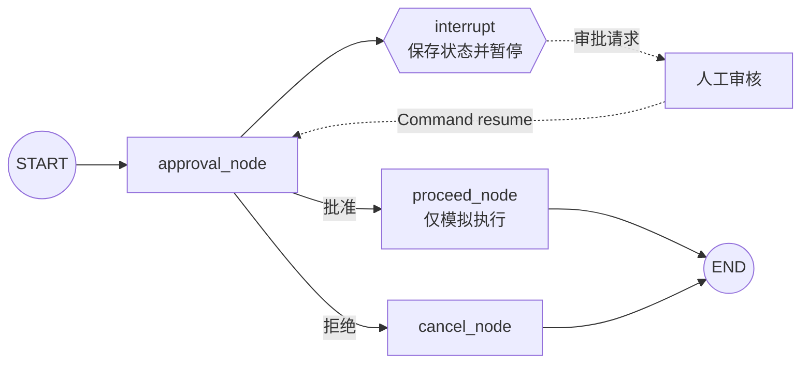

# 11｜LangGraph 人工审批：interrupt、Command 与中断恢复

这一节学习 Human-in-the-loop（人在回路中）：工作流运行到高风险步骤时先暂停，把操作详情交给人工审核；审核者给出“批准”或“拒绝”后，图从保存的检查点恢复，并进入相应分支。

完整示例使用“模拟转账”解释流程，但**不会连接银行、支付或任何外部系统，也不会执行真实转账**。读完后应能说明：`interrupt()` 保存了什么、为什么恢复时必须使用相同 `thread_id`、`Command(resume=...)` 与节点返回的 `Command(update=..., goto=...)` 分别负责什么。

## 一句话理解

`interrupt()` 把当前节点暂停并向调用方暴露审批请求；Checkpointer 保存线程状态；调用方用同一 `thread_id` 和 `Command(resume=审批结果)` 恢复；恢复值成为原来 `interrupt()` 的返回值，节点再用 `Command` 更新状态并决定下一站。

## 流程图



注意：恢复后不是从 `interrupt()` 的下一行直接继续一段冻结的 Python 调用栈，而是**从所在节点的开头重新执行**。LangGraph 会让同一位置的 `interrupt()` 返回已提供的恢复值。

## 1. 什么是 Human-in-the-loop

Human-in-the-loop，简称 HITL，是指自动化流程在关键位置主动等待人工输入。常见场景包括：

- 支付、退款、转账等资金操作。
- 删除数据、修改权限、发布内容等不可轻易撤回的操作。
- 人工审阅并修改模型生成的邮件、合同摘要或回复草稿。
- 模型准备调用外部工具前，展示参数并等待确认。
- 信息不足或模型无法可靠判断时，交给人工补充。

它不是简单的 `input()`：普通 `input()` 会一直占用当前进程；LangGraph 的中断会把图状态写入 Checkpointer，调用结束后仍可在之后使用同一线程恢复。

## 2. 应用负责什么，LangGraph 提供什么

| 层次 | 主要职责 |
| --- | --- |
| LangGraph | 暂停图、保存状态、暴露中断信息、匹配恢复值、继续节点、动态路由 |
| 应用 | 展示审批界面、验证审核者身份、校验输入、设置超时和权限、记录审计日志、执行真实业务动作 |

LangGraph 提供的是工作流原语，不会自动判断“谁有资格批准”，也不会自动保证转账、删除等外部操作安全。生产应用必须在框架外补上身份认证、授权、审计、幂等和风险控制。

## 3. 状态为什么不用 Optional

示例把状态拆成三个字段：

```python
ApprovalDecision = Literal["批准", "拒绝"]
ApprovalStatus = Literal["等待", "批准", "拒绝"]


class ApprovalState(TypedDict):
    action_details: str
    status: ApprovalStatus
    outcome: NotRequired[str]
```

- `action_details`：需要审核的操作详情。
- `status`：当前审批状态，初始值明确为“等待”。
- `outcome`：分支执行完成后的说明，因此使用 `NotRequired`。

原始代码把 `status` 写成 `Optional[...]`，但实际调用总会传入“等待”，后续也总会写入结果。这里直接使用 `ApprovalStatus`，能让状态契约更清楚。

## 4. interrupt 的参数不是返回值

```python
decision = interrupt(
    {
        "question": "是否批准此操作？",
        "details": state["action_details"],
        "options": ["批准", "拒绝"],
    }
)
```

第一次运行到这里时：

1. `interrupt()` 接收的字典成为中断载荷。
2. LangGraph 使用 Checkpointer 保存当前线程状态。
3. 当前图运行暂停，`approval_node` 不会正常返回。
4. `graph.invoke()` 的结果中出现 `__interrupt__`。

调用方之后执行：

```python
graph.invoke(Command(resume="批准"), config=config)
```

恢复时，字符串“批准”才会成为节点中 `interrupt()` 表达式的返回值。因此要区分：

| 数据 | 流向 |
| --- | --- |
| 传给 `interrupt(...)` 的字典 | 图 → 审批界面或调用方 |
| 传给 `Command(resume=...)` 的值 | 审批界面或调用方 → 图 |

## 5. 为什么必须配置 Checkpointer

中断后，图要记住：

- 当前状态内容。
- 暂停在哪个节点。
- 哪个任务正在等待恢复。
- 中断的标识和载荷。

示例使用：

```python
graph = builder.compile(checkpointer=InMemorySaver())
```

没有 Checkpointer，运行时无法在两次独立调用之间可靠保存和恢复图的位置。

`InMemorySaver` 适合教学和单进程测试，Python 进程退出后数据就会消失。需要跨进程、跨重启或长时间等待时，应使用 PostgreSQL 等持久化 Checkpointer。

## 6. thread_id 是恢复指针

```python
config = {"configurable": {"thread_id": "approval-demo"}}
```

首次调用和恢复调用必须使用同一个 `thread_id`：

```python
pending = graph.invoke(initial_state, config=config)
final = graph.invoke(Command(resume="批准"), config=config)
```

如果恢复时换成另一个 ID，LangGraph 会把它当成另一条线程，找不到原来等待审批的检查点。

真实系统应使用稳定且不可碰撞的业务标识，例如审批单 ID 或工作流实例 ID；不要让不同用户误用同一个固定线程 ID。

## 7. 如何读取中断请求

使用普通 `invoke()` 时，中断信息位于结果的 `__interrupt__` 字段：

```python
pending_interrupts = pending_result.get("__interrupt__", ())
request = pending_interrupts[0]

print(request.value)
print(request.id)
```

- `request.value` 是传入 `interrupt()` 的审批载荷。
- `request.id` 是中断标识。并行分支同时产生多个中断时，可用 ID 将每个恢复值与对应中断配对。

当前官方文档也推荐复杂交互使用 `graph.stream_events(..., version="v3")`，通过 `stream.interrupted` 与 `stream.interrupts` 处理暂停；本例保留 `invoke()`，因为两阶段调用对初学者更直观。

## 8. Command(resume=...) 只负责恢复

```python
final_result = graph.invoke(
    Command(resume=decision),
    config=config,
)
```

作为 `invoke()` 的输入时，这里使用的是 `resume`：它把人工结果送回挂起的 `interrupt()`。

不要用下面的写法恢复中断：

```python
# 错误理解：update 不是恢复中断的输入协议
graph.invoke(Command(update={"status": "批准"}), config=config)
```

`Command(update=...)` 和 `Command(goto=...)` 主要用于**节点的返回值**；`Command(resume=...)` 才是恢复中断时传给图的输入。

## 9. 节点返回的 Command 同时更新状态和路由

恢复后，审批节点验证决定并返回：

```python
return Command(
    update={"status": decision},
    goto="proceed_node" if decision == "批准" else "cancel_node",
)
```

这个 `Command` 完成两件事：

1. `update` 把审批结果写入共享状态。
2. `goto` 动态选择下一个节点。

因此示例不需要再为审批节点添加条件边。批准和拒绝节点仍各自连接到 `END`。

## 10. 为什么给 Command 标注可达节点

```python
ApprovalDestination = Literal["proceed_node", "cancel_node"]


def approval_node(
    state: ApprovalState,
) -> Command[ApprovalDestination]:
    ...
```

返回类型明确告诉类型检查器和图构建工具：该节点只会跳到两个目标之一。它能减少节点名称拼错的问题，也让动态图的可达关系更容易被理解和可视化。

## 11. Command 路由与条件边怎么选

两种写法都可以实现审批分支。

### 写法一：节点返回状态，条件边负责路由

```python
def approval_node(state):
    decision = interrupt(...)
    return {"status": decision}


def route(state):
    return "proceed_node" if state["status"] == "批准" else "cancel_node"
```

优点是“计算状态”和“决定路径”分开，适合希望集中查看路由规则的图。

### 写法二：节点返回 Command

```python
return Command(update={"status": decision}, goto=next_node)
```

优点是一次返回同时表达状态更新和目的地，适合决定与该节点高度相关的动态路由。本节采用这种方式。

## 12. 恢复时节点会从头重新执行

这是最重要的安全规则之一。假设写成：

```python
charge_credit_card()  # 危险：位于 interrupt 前
decision = interrupt("是否批准？")
```

首次运行会执行一次扣款；恢复时节点从头重跑，扣款可能再次执行。正确思路是：

```python
decision = interrupt("是否批准？")
if decision == "批准":
    return Command(goto="execute_action")
```

把有副作用的工作放在批准后的独立节点中，并为外部操作增加幂等键。`interrupt()` 之前只做可重复、无副作用或幂等的准备工作。

同一节点有多个 `interrupt()` 时也不能在恢复之间随意改变调用顺序；LangGraph 会按执行顺序匹配恢复值。

## 13. 为什么要严格校验审批结果

原始代码把所有非“批准”的文本都当成拒绝：

```python
if decision == "批准":
    ...
else:
    ...
```

这样会把拼写错误、空字符串、错误对象等输入静默变成拒绝，难以发现接口问题。完整示例使用：

```python
def validate_decision(value: object) -> ApprovalDecision:
    if not isinstance(value, str):
        raise ValueError(...)
    normalized = value.strip()
    if normalized not in ("批准", "拒绝"):
        raise ValueError(...)
    return cast(ApprovalDecision, normalized)
```

生产系统还应校验审核者身份、角色、审批单版本、有效期和签名，不能只相信前端传来的字符串。

## 14. “取消”和“拒绝”的类型不一致

原始状态声明允许：

```python
Literal["等待", "批准", "拒绝"]
```

但取消节点返回：

```python
{"status": "取消"}
```

`TypedDict` 只提供静态类型提示，不会在运行时自动拦住这个值，因此程序能运行，但状态契约已经被破坏。本例统一使用“拒绝”，让类型声明、恢复值和最终状态保持一致。

如果业务确实需要区分“审核拒绝”和“发起人取消”，应把“取消”加入状态类型，并设计独立事件与分支，而不是混用两个词。

## 15. 为什么批准节点只做模拟

示例的 `proceed_node` 只生成字符串：

```python
outcome = f"已批准：{state['action_details']}（仅模拟，未真实执行）"
return {"status": "批准", "outcome": outcome}
```

这是为了把注意力放在中断恢复机制上。真实资金或数据操作至少还需要：

- 服务端重新读取权威业务数据，不能直接相信展示给审核者的文本。
- 验证审核者权限，并防止本人审批自己的高风险操作。
- 检查审批单未过期、未撤销、未被修改。
- 使用幂等键，避免重试或重复恢复造成重复执行。
- 把审批人、时间、旧值、新值和执行结果写入不可随意修改的审计日志。
- 对高金额或高权限操作设置双人复核。

## 16. 配置与运行

复制配置：

```bash
# Windows PowerShell
Copy-Item .env.example .env

# macOS / Linux
cp .env.example .env
```

可选配置：

```env
APPROVAL_THREAD_ID=approval-demo
APPROVAL_ACTION_DETAILS=模拟转账 30000 元（不会真实执行）

# 不配置时程序会在终端询问；自动演示时可填写批准或拒绝
# APPROVAL_DECISION=批准
```

运行：

```bash
python langgraph_human_in_the_loop_approval.py
```

如果没有配置 `APPROVAL_DECISION`，终端会在图暂停后要求输入“批准”或“拒绝”。

## 17. 预期运行过程

第一次 `invoke()` 会返回等待中的状态和中断信息，终端显示类似：

```text
收到审批请求：
{
  "question": "是否批准此操作？",
  "details": "模拟转账 30000 元（教学示例，不会连接真实支付系统）",
  "options": ["批准", "拒绝"]
}
```

输入“批准”后：

```text
使用同一 thread_id 恢复，审批结果：批准
已批准：模拟转账 30000 元……（仅模拟，未真实执行）
最终状态：status 为 批准
```

输入“拒绝”后会进入 `cancel_node`，最终状态为“拒绝”。中断 ID 和模型无关，每次新的挂起任务都可能不同。

## 18. 原始学习代码中的实用改进

1. 修正 `status` 类型与取消分支返回值不一致的问题。
2. 把 `Command` 的 `update` 与 `goto` 放在同一个返回值中。
3. 为 `Command` 标注两个可能的目标节点。
4. 对恢复值进行严格类型和枚举校验。
5. 显式读取并展示 `__interrupt__` 中的请求载荷与中断 ID。
6. 未配置决定时现场询问，避免示例默认静默批准。
7. 将图构建封装为 `build_graph()`，便于分别测试批准与拒绝分支。
8. 增加主入口保护，导入模块不会启动审批流程。
9. 批准节点只做模拟，不包含真实外部副作用。
10. 使用环境变量管理线程 ID、操作详情和可选演示决定。

## 19. 常见错误

### 没有 Checkpointer

`interrupt()` 依赖持久化层保存暂停状态。编译图时必须传入 Checkpointer。

### 恢复时使用了不同 thread_id

新的线程没有原来的挂起任务。保存第一次调用使用的配置，并在恢复时原样复用。

### 把普通字典当作恢复输入

恢复中断应传入 `Command(resume=...)`，而不是再次传入初始状态字典；后者会启动新的状态更新流程。

### 把外部操作放在 interrupt 前面

恢复会从节点开头重跑，可能导致邮件重复发送、数据库重复写入或资金操作重复执行。

### 认为 TypedDict 会做运行时校验

`TypedDict` 主要服务于静态检查。来自网页、接口或人工表单的恢复值仍要在运行时验证。

### 进程重启后无法恢复

`InMemorySaver` 的数据只存在当前进程内。换用数据库 Checkpointer，并确保应用重启后仍使用原来的 `thread_id`。

### 同一个审批被恢复两次

外部系统必须让执行节点幂等，并检查审批单是否已经完成；不能只依赖界面隐藏按钮。

## 20. 安全与生产检查清单

- 中断载荷只包含审核所需信息，避免泄露密钥和不必要的个人数据。
- 审批决定必须由服务端绑定到已认证的审核者。
- 校验审核者对该资源和操作具有权限。
- 高风险操作使用双人审批、金额阈值或职责分离。
- 记录审批请求、审核者、决定、理由、时间和执行结果。
- 为审批设置有效期、撤回和升级机制。
- 执行前重新校验资源版本，避免批准后数据已被替换。
- 使用幂等键和事务，处理重试、崩溃与重复恢复。
- 真实副作用放在审批后的独立节点中。
- 生产环境使用持久化 Checkpointer，并保护其中的敏感状态。

## 21. 复习问答

<details>
<summary>1. interrupt() 第一次执行时会返回审批结果吗？</summary>

不会。第一次会暂停图并把传入的载荷暴露给调用方；之后 `Command(resume=...)` 中的值才会在恢复时成为 `interrupt()` 的返回值。

</details>

<details>
<summary>2. 为什么恢复时必须复用 thread_id？</summary>

Checkpointer 使用线程 ID 找到该工作流保存的状态和挂起任务。不同 ID 指向另一条独立线程。

</details>

<details>
<summary>3. Command(resume=...) 和 Command(goto=...) 有什么区别？</summary>

前者作为图输入，把人工结果送回中断点；后者通常由节点返回，用来选择下一个节点。节点还可以同时通过 `update` 修改状态。

</details>

<details>
<summary>4. 恢复后节点从哪里执行？</summary>

从包含 `interrupt()` 的节点开头重新执行。到达同一中断调用时，LangGraph 返回保存的恢复值。因此中断前的代码必须可安全重放。

</details>

<details>
<summary>5. InMemorySaver 能等待几天后再恢复吗？</summary>

只要原 Python 进程和内存仍存在就可能恢复，但它不适合可靠的长时间等待。生产系统应使用数据库持久化 Checkpointer。

</details>

<details>
<summary>6. 为什么批准后还需要幂等控制？</summary>

调用可能重试，服务可能崩溃并恢复，客户端也可能重复提交。没有幂等键，同一批准可能触发两次真实副作用。

</details>

<details>
<summary>7. LangGraph 会验证审核者身份吗？</summary>

不会。LangGraph负责暂停、持久化和恢复；身份认证、授权、职责分离与审计由应用实现。

</details>

<details>
<summary>8. TypedDict 能阻止“稍后决定”这样的非法值吗？</summary>

不能保证。它主要是静态类型提示，运行时仍需显式校验外部输入。

</details>

## 22. 可以继续练习

- 在审批状态中加入 `reviewer_id`、`reason` 和 `reviewed_at`。
- 让审核者除了批准或拒绝，还能修改待执行参数。
- 使用条件边重做同一流程，并比较它与 `Command(goto=...)` 的可读性。
- 把 `InMemorySaver` 换成 `PostgresSaver`，重启程序后继续审批。
- 为审批增加超时和自动拒绝分支。
- 设计双人审批：两个不同审核者都批准后才进入执行节点。
- 使用中断 ID 一次恢复多个并行审批。
- 给执行节点加入幂等键，并测试重复恢复不会重复执行。

## 官方资料

- [LangGraph Interrupts](https://docs.langchain.com/oss/python/langgraph/interrupts)
- [LangGraph interrupt reference](https://reference.langchain.com/python/langgraph/types/interrupt)
- [LangGraph Command reference](https://reference.langchain.com/python/langgraph/types/Command)
- [LangGraph Persistence](https://docs.langchain.com/oss/python/langgraph/persistence)

## 完整源码

见 [`langgraph_human_in_the_loop_approval.py`](../langgraph_human_in_the_loop_approval.py)。
