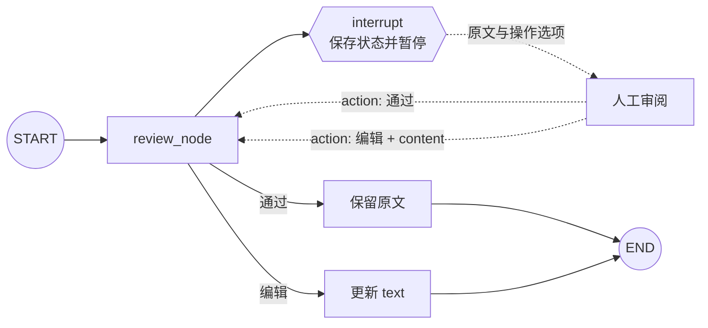

# 12｜LangGraph 人工审阅与内容编辑

这一节继续学习 Human-in-the-loop：工作流生成或接收一段内容后先暂停，把原文交给人工审阅；审阅者可以直接通过，也可以提交修改后的版本。图恢复后把最终文本写回状态，再正常结束。

与上一节的“批准后进入哪个业务分支”不同，本节关注的是：**人工如何检查并修改状态中的内容，以及结构化恢复值怎样避免字符串布尔值造成的歧义。**

## 一句话理解

`interrupt()` 把当前文本和审阅说明交给调用方；调用方使用 `Command(resume={...})` 返回“通过”或“编辑”动作；通过时保留原文，编辑时用人工内容更新 `state["text"]`。

## 流程图



## 1. 本节解决什么问题

模型或程序生成的内容不一定能直接进入下一步。常见的人工审阅场景包括：

- 发布文章前检查事实、语气和错别字。
- 发送邮件前修改收件人、主题或正文。
- 使用模型生成的客服回复前补充业务信息。
- 保存合同摘要前由专业人员确认关键条款。
- 执行工具调用前修改参数。

人工审阅不是让模型“再润色一次”，而是把最终控制权交给经过授权的人。

## 2. 应用能力与 LangGraph 能力边界

| 层次 | 负责的事情 |
| --- | --- |
| LangGraph | 暂停节点、保存状态、暴露待审阅内容、接收恢复值、更新状态、继续执行 |
| 应用 | 展示编辑器、认证审阅者、控制权限、校验内容、处理版本冲突、保存审计记录 |

LangGraph 不会自动生成网页编辑器，也不会判断审阅者是否有权修改内容。它提供的是中断、持久化和恢复机制；具体产品体验与安全规则由应用实现。

## 3. 为什么不用字符串 "true" 和 "false"

原始代码使用：

```python
if updated["success"] == "true":
    return {}
```

这里有三个问题：

1. `"true"` 是字符串，不是 Python 布尔值 `True`。
2. `success` 没有说明“成功”究竟是通过原文、编辑成功，还是接口提交成功。
3. 除了精确字符串 `"true"` 之外的任何值都会进入编辑分支。

完整示例改用明确动作：

```python
{"action": "通过"}
```

或者：

```python
{"action": "编辑", "content": "编辑后的内容"}
```

这种协议更容易阅读、校验和扩展。以后还可以加入“拒绝”“退回重写”等动作。

## 4. 状态与恢复值是两个不同 Schema

图状态保存最终内容和审阅进度：

```python
ReviewStatus = Literal["等待", "通过", "已编辑"]


class ReviewState(TypedDict):
    text: str
    review_status: NotRequired[ReviewStatus]
```

恢复值描述人工本次提交的动作：

```python
ReviewAction = Literal["通过", "编辑"]


class ReviewResponse(TypedDict):
    action: ReviewAction
    content: NotRequired[str]
```

为什么分开：

- State 是工作流长期保存的数据。
- ReviewResponse 是一次中断恢复的输入协议。
- “通过”不需要新的 `content`，因此该字段是可选的。
- “编辑”必须带非空 `content`，这个条件需要运行时校验。

## 5. 第一次调用如何暂停

```python
pending_result = graph.invoke(
    {
        "text": "初始文章……",
        "review_status": "等待",
    },
    config=config,
)
```

图进入 `review_node` 后调用：

```python
response = interrupt(
    {
        "instruction": "请查看内容，选择直接通过或提交编辑版本。",
        "content": state["text"],
        "options": ["通过", "编辑"],
    }
)
```

此时节点暂停，`graph.invoke()` 返回的结果包含：

- 已保存的 `text`。
- 当前 `review_status`。
- `__interrupt__` 中的审阅请求。

`interrupt()` 的载荷应当可以 JSON 序列化，方便通过 API 发送给网页或其他客户端。

## 6. 如何读取审阅请求

```python
pending_interrupts = pending_result.get("__interrupt__", ())
request = pending_interrupts[0]

print(request.value)
print(request.id)
```

- `request.value` 是审阅界面需要展示的说明、原文和选项。
- `request.id` 是中断标识；多个任务同时中断时，可用它精确匹配恢复值。

本例使用普通 `invoke()` 便于展示两个阶段。复杂交互也可以使用官方推荐的 `stream_events(..., version="v3")`，通过 `stream.interrupted` 与 `stream.interrupts` 处理暂停。

## 7. 如何恢复图

直接通过：

```python
graph.invoke(
    Command(resume={"action": "通过"}),
    config=config,
)
```

提交编辑版本：

```python
graph.invoke(
    Command(
        resume={
            "action": "编辑",
            "content": "编辑后的文章……",
        }
    ),
    config=config,
)
```

首次调用和恢复调用必须使用同一个 `config`，尤其是相同的 `thread_id`。恢复字典会成为节点中 `interrupt()` 的返回值。

## 8. 通过时为什么只更新状态字段

```python
if response["action"] == "通过":
    return {"review_status": "通过"}
```

节点没有返回 `text`，并不代表文本被清空。LangGraph 只更新返回字典中出现的字段，因此原来的 `state["text"]` 会继续保留。

原始代码返回空字典 `{}` 也能保留文本，但增加 `review_status` 更利于界面展示、调试和审计。

## 9. 编辑时如何覆盖文本

```python
return {
    "text": response["content"],
    "review_status": "已编辑",
}
```

`text` 没有配置 Reducer，因此节点返回的新字符串会直接成为该字段的新值。最终状态同时说明内容已被人工修改。

如果希望保留修改前版本，不要只覆盖一个字符串。可以增加：

```python
original_text: str
edited_text: str
```

或维护带时间、审阅者和版本号的历史记录。

## 10. 为什么必须校验恢复值

中断恢复值通常来自网页请求、消息队列或其他客户端，都属于外部输入。完整示例检查：

- 整体必须是字典。
- `action` 只能是“通过”或“编辑”。
- “编辑”动作必须包含字符串类型的 `content`。
- 编辑内容去掉首尾空白后不能为空。

```python
def validate_review_response(value: object) -> ReviewResponse:
    if not isinstance(value, dict):
        raise ValueError(...)

    action = value.get("action")
    if action not in ("通过", "编辑"):
        raise ValueError(...)

    if action == "编辑":
        content = value.get("content")
        if not isinstance(content, str) or not content.strip():
            raise ValueError(...)
```

`TypedDict` 主要用于静态类型检查，不会自动验证网络请求中的字典。运行时校验不能省略。

## 11. Checkpointer 与 thread_id

```python
graph = builder.compile(checkpointer=InMemorySaver())
config = {"configurable": {"thread_id": "human-review-demo"}}
```

Checkpointer 保存暂停时的状态和执行位置，`thread_id` 告诉运行时要恢复哪一条工作流实例。

`InMemorySaver` 只适合教学和单进程测试：程序退出后，等待审阅的任务就无法恢复。生产环境应换成数据库 Checkpointer，并使用稳定且唯一的文档或审阅任务 ID。

## 12. 恢复时 review_node 会从头执行

LangGraph 恢复中断时，会从包含 `interrupt()` 的节点开头重新运行。运行到同一中断调用后，框架返回已经提供的恢复值。

因此不要在中断之前发送邮件、写数据库或发布内容：

```python
# 不安全：恢复时可能再次发布
publish_article(state["text"])
response = interrupt(...)
```

正确方式是先审阅，再让后续独立节点执行副作用：

```text
review_node → publish_node
```

并给发布操作添加幂等键，防止重试导致重复发布。

## 13. 为什么本节不需要 Command(goto=...)

图结构已经固定：

```python
builder.add_edge(START, "review_node")
builder.add_edge("review_node", END)
```

无论通过还是编辑，节点都只需要更新状态，之后沿固定边进入 `END`。因此节点返回普通状态字典即可。

上一节的审批示例需要批准和拒绝进入不同业务节点，才使用：

```python
Command(update=..., goto=...)
```

这说明 `Command(resume=...)` 与 `Command(goto=...)` 是不同用途：

| 写法 | 使用位置 | 作用 |
| --- | --- | --- |
| `Command(resume=...)` | 作为图的输入 | 恢复挂起的中断 |
| `Command(update=..., goto=...)` | 作为节点返回值 | 更新状态并动态路由 |

## 14. 审阅界面怎样接入

真实应用通常分成两个 HTTP 请求：

1. 后端启动图并得到中断信息。
2. 前端展示 `request.value["content"]`。
3. 审阅者选择通过，或在编辑器中修改内容。
4. 前端把结构化结果提交给后端。
5. 后端验证身份、权限和内容后，用同一 `thread_id` 恢复图。

不要把 Checkpointer 的内部对象直接暴露给浏览器。前端只应获得完成任务需要的字段，后端负责把业务审阅单与线程 ID、安全身份和中断 ID 关联起来。

## 15. 配置与运行

复制配置：

```bash
# Windows PowerShell
Copy-Item .env.example .env

# macOS / Linux
cp .env.example .env
```

可选配置：

```env
REVIEW_THREAD_ID=human-review-demo
REVIEW_INITIAL_TEXT=初始文章……

# 留空时由终端现场询问；可选值：通过、编辑
REVIEW_ACTION=
REVIEW_EDITED_TEXT=编辑后的文章……
```

运行：

```bash
python langgraph_human_review_edit.py
```

如果 `REVIEW_ACTION` 留空，程序会先展示中断载荷，再让终端用户选择“通过”或“编辑”。只有选择编辑时才需要提供新文本。

## 16. 预期结果

首次运行会显示类似请求：

```text
收到人工审阅请求：
{
  "instruction": "请查看内容，选择直接通过或提交编辑版本。",
  "content": "初始文章……",
  "options": ["通过", "编辑"]
}
```

选择通过后：

```text
text: 初始文章……
review_status: 通过
```

选择编辑并输入“编辑后的文章……”后：

```text
text: 编辑后的文章……
review_status: 已编辑
```

中断 ID 每次可能不同，不应写死在程序中。

## 17. 原始学习代码中的实用改进

1. 用“通过/编辑”动作代替字符串布尔值 `"true"/"false"`。
2. 为图状态和恢复值分别定义 TypedDict。
3. 增加审阅状态，便于展示和审计。
4. 对恢复值执行严格的运行时校验。
5. 编辑内容必须是非空字符串，并统一去除首尾空白。
6. 中断载荷提供明确选项和返回示例。
7. 显式展示 `__interrupt__` 载荷和中断 ID。
8. 把图构建封装为 `build_graph()`，便于测试两个分支。
9. 使用环境变量配置线程 ID、原文和演示操作。
10. 增加主入口保护，导入模块不会启动交互。

## 18. 常见错误

### 把字符串 "false" 当成布尔值

非空字符串在 Python 中都是真值，`bool("false")` 仍然是 `True`。应使用真正的布尔值，或者像本例一样使用明确动作枚举。

### 编辑动作没有 content

恢复前后都应校验。不能把缺少内容的请求直接写入状态。

### 恢复时更换 thread_id

新的线程找不到原来的挂起任务。首次运行与恢复必须复用同一配置。

### 没有 Checkpointer

中断依赖持久化层保存状态和执行位置。编译图时必须提供 Checkpointer。

### 误以为返回 {} 会清空文本

普通 State 字段只更新返回值中出现的键；空字典表示没有状态更新，原文仍然保留。

### 进程重启后任务丢失

`InMemorySaver` 不跨进程持久化。生产环境应使用数据库后端。

### 审阅期间原文已经变化

这是版本冲突。审批单应保存文档版本或内容哈希，恢复前确认审阅者看到的版本仍是当前版本。

## 19. 安全与内容治理

- 审阅者必须经过身份认证和权限校验。
- 中断载荷只发送审阅需要的字段，避免泄露密钥和隐私信息。
- 人工编辑内容仍是不可信输入，显示到网页时需要防止 XSS。
- 编辑后的文本进入模型提示词或工具参数前，应考虑提示注入与命令注入风险。
- 保存原文、编辑版本、审阅者、时间、动作和理由，形成审计记录。
- 使用版本号或内容哈希处理多人同时编辑。
- 给审阅任务设置过期、撤回和重新分配机制。
- 发布、发送或写库等副作用放在审阅后的独立节点中，并保证幂等。
- 法律、医疗、财务等高风险文本应由具备相应资质的人审阅。

## 20. 复习问答

<details>
<summary>1. interrupt() 传入的字典和 Command(resume=...) 传入的字典有什么区别？</summary>

前者从图流向调用方，用于展示审阅请求；后者从调用方流回图，成为 `interrupt()` 恢复后的返回值。

</details>

<details>
<summary>2. 为什么“通过”时不需要重新返回 text？</summary>

LangGraph 只更新节点返回字典中出现的字段。没有更新 `text` 时，状态会继续保留暂停前的原文。

</details>

<details>
<summary>3. 为什么不用 success: "true"？</summary>

字符串布尔值容易与真正的布尔类型混淆，而且 `success` 无法清晰表达审阅动作。明确的动作枚举更容易理解和扩展。

</details>

<details>
<summary>4. TypedDict 会自动拒绝缺少 content 的编辑请求吗？</summary>

不会。TypedDict 主要用于静态检查；来自接口或终端的字典需要运行时校验。

</details>

<details>
<summary>5. 本节为什么不使用 Command(goto=...)？</summary>

通过和编辑最终都沿同一条固定边结束，只需更新状态。只有不同结果需要跳向不同节点时，动态 goto 才更有价值。

</details>

<details>
<summary>6. 为什么恢复时节点会重新执行？</summary>

LangGraph 的持久化恢复以节点为边界。恢复后从中断所在节点开头重放，到达同一 `interrupt()` 时返回保存的恢复值。

</details>

<details>
<summary>7. 人工编辑后的内容可以直接发布吗？</summary>

不能一概而论。仍需做权限、内容安全、版本冲突和业务规则校验；高风险场景还需要额外复核。

</details>

<details>
<summary>8. InMemorySaver 适合线上长时间审阅吗？</summary>

不适合。进程退出会丢失状态，应使用持久化数据库 Checkpointer。

</details>

## 21. 可以继续练习

- 增加“拒绝”和“退回模型重写”动作。
- 保存 `original_text`、`edited_text`、`reviewer_id` 和编辑理由。
- 使用 Pydantic 模型校验恢复值并生成前端表单 Schema。
- 把 `InMemorySaver` 换成 `PostgresSaver`，重启后继续审阅。
- 增加版本号，模拟审阅期间文档发生变化的冲突。
- 增加发布节点，并用幂等键测试重复恢复不会重复发布。
- 使用中断 ID 同时处理多个并行内容审阅任务。
- 把终端输入替换为一个简单网页编辑器。

## 官方资料

- [LangGraph Interrupts](https://docs.langchain.com/oss/python/langgraph/interrupts)
- [LangGraph interrupt reference](https://reference.langchain.com/python/langgraph/types/interrupt)
- [LangGraph Command reference](https://reference.langchain.com/python/langgraph/types/Command)
- [LangGraph Persistence](https://docs.langchain.com/oss/python/langgraph/persistence)

## 完整源码

见 [`langgraph_human_review_edit.py`](../langgraph_human_review_edit.py)。
