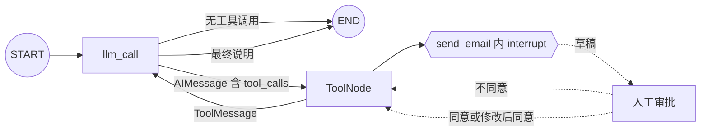

# 13｜LangGraph 邮件工具调用前的人工审批

这一节把 Human-in-the-loop 放进真正的 Agent 工具调用循环：模型先根据用户请求生成 `send_email` 工具调用；工具在产生外部副作用之前用 `interrupt()` 暂停；人工可以拒绝，也可以批准并修改收件人、主题或正文；恢复后工具把结果作为 `ToolMessage` 交回模型，由模型生成最终答复。

完整示例只在终端打印“模拟发送”结果，不连接真实邮件服务。重点是学会控制副作用发生的时机，而不是实现邮件供应商 API。

## 一句话理解

模型负责提出“想发送什么邮件”，LangGraph 负责暂停、持久化和恢复，应用负责把草稿展示给有权限的人并收集决定；只有人工同意后，邮件工具才允许进入发送步骤。

## 流程图



## 1. 为什么邮件发送需要人工审批

普通问答只生成文本，邮件工具却可能产生真实外部影响：

- 把内容发送给第三方。
- 泄露隐私、商业信息或错误附件。
- 因模型识别错误而发给错误收件人。
- 使用不合适的主题、语气或正文。
- 重试时重复发送。

因此“模型决定调用工具”不等于“应用已经授权执行工具”。对于邮件、付款、发布、删除等高影响操作，应在真正的副作用之前设置明确的人工关卡。

## 2. 应用能力与 LangGraph 能力边界

| 层次 | 负责的事情 |
| --- | --- |
| 大模型 | 理解用户意图，生成工具名称与参数，读取工具结果并组织最终回复 |
| LangGraph | 保存消息状态、执行节点路由、暂停工具、持久化检查点、接收恢复值并继续运行 |
| 应用 | 登录与权限、审批界面、审批人身份、字段校验、真实邮件 API、幂等键、审计与告警 |

`interrupt()` 不会自动判断谁有资格批准，也不会替你发送邮件。它提供的是可靠的“暂停—等待—恢复”控制点。

## 3. 完整消息时间线

批准或拒绝一次邮件工具调用时，消息序列大致是：

```text
HumanMessage
    ↓
AIMessage(tool_calls=[send_email(...)])
    ↓
工具内部 interrupt，图暂停
    ↓
Command(resume={...})
    ↓
ToolMessage（已模拟发送或已取消）
    ↓
AIMessage（给用户的最终说明）
```

原始学习代码在得到 `ToolMessage` 后就结束了，所以最后一条消息仍是工具结果。完整示例让 `ToolNode` 再回到 `llm_call`，模型能够把机器可读的工具结果转换为自然语言回复。

## 4. 为什么使用 ToolNode

原始代码在模型节点里手动执行：

```python
tool_result = send_email.invoke(tool_call["args"])
```

教学时这样写容易看到每一步，但需要自己处理：

- 工具名称与注册表的对应关系。
- `ToolMessage` 和 `tool_call_id`。
- 多工具调用。
- 参数错误与工具异常。
- 工具执行后的回环。

完整示例使用：

```python
builder.add_node("tools", ToolNode([send_email]))
```

`ToolNode` 会读取最后一条 `AIMessage` 中的 `tool_calls`、执行匹配工具，并把结果变成对应的 `ToolMessage`。这更接近标准 Agent 图结构。

## 5. 模型为什么要 bind_tools

```python
model.bind_tools([send_email])
```

这一步把工具名称、说明和参数 Schema 提供给模型。模型不会直接运行 Python 函数，而是生成结构化申请，例如：

```python
{
    "name": "send_email",
    "args": {
        "to": "alice@example.com",
        "subject": "请假",
        "body": "回老家",
    },
    "id": "call_123",
    "type": "tool_call",
}
```

运行工具的是应用代码或 `ToolNode`，不是模型本身。这一区分非常重要：模型只能提出操作，程序决定是否执行。

## 6. interrupt 为什么放在工具内部

```python
@tool
def send_email(to: str, subject: str, body: str) -> str:
    review = interrupt({...})
    # 审批通过后才执行发送逻辑
```

把中断放在工具开头，可以让审批请求精确包含模型已经生成的最终工具参数。审批人看到的是具体收件人、主题与正文，而不是模糊的“是否允许 Agent 使用邮件工具”。

关键原则是：**中断之前不能执行真实发送。**

恢复时，包含 `interrupt()` 的节点或工具会从开头重新执行。如果把发送放在中断之前，恢复时可能重复发送。

## 7. 中断载荷应该包含什么

示例暴露：

```python
{
    "action": "发送邮件",
    "message": "请检查邮件草稿；可以拒绝，或批准并修改字段。",
    "draft": {
        "to": "alice@example.com",
        "subject": "请假",
        "body": "回老家",
    },
    "options": ["同意", "不同意"],
    "response_examples": [...],
}
```

真实系统还可以加入：

- 申请人或 Agent 身份。
- 任务 ID 与创建时间。
- 数据敏感级别。
- 收件人所属组织。
- 附件名称与哈希。
- 过期时间。

不要把 API Key、SMTP 密码或与审批无关的隐私数据放进中断载荷。

## 8. 恢复值使用明确动作

直接同意：

```python
Command(resume={"action": "同意"})
```

拒绝：

```python
Command(
    resume={
        "action": "不同意",
        "reason": "收件人不正确",
    }
)
```

修改主题后同意：

```python
Command(
    resume={
        "action": "同意",
        "subject": "请病假",
    }
)
```

一次修改多个字段：

```python
Command(
    resume={
        "action": "同意",
        "to": "manager@example.com",
        "subject": "请假申请",
        "body": "因家中有事，申请请假一天。",
    }
)
```

`action` 只表示是否授权，字段是否出现表示是否修改。这样比“同意，需要修改主题”“同意，需要修改内容”等自由文本更容易验证和扩展。

## 9. 为什么拒绝时忽略字段修改

原始调用示例同时提交了：

```python
{
    "action": "不同意",
    "subject": "请病假",
}
```

拒绝表示不会发送，因此修改主题没有实际意义。完整示例会返回取消结果，不会执行字段合并。

如果产品需要“修改后暂存但暂不发送”，应设计第三个明确动作，例如：

```text
同意发送 / 拒绝 / 保存草稿
```

不要让一个动作同时承担多个含义。

## 10. 合并人工修改后的参数

批准后，每个可选字段都使用“人工值优先，模型值兜底”：

```python
final_to = review.get("to", original_to)
final_subject = review.get("subject", original_subject)
final_body = review.get("body", original_body)
```

这支持三种情况：

1. 全部不改，直接批准。
2. 只修改一个字段。
3. 同时修改多个字段。

原始代码最后一个注释示例写的是“修改内容”，却把值放进了 `subject`。正确字段应为 `body`。

## 11. 为什么还要做运行时校验

类型提示不能保护网络边界。恢复值可能来自网页、移动端、队列或第三方系统，必须在运行时检查：

- 整体必须是字典。
- `action` 只能是“同意”或“不同意”。
- 可选字段必须是字符串。
- 收件人、主题和正文不能为空。
- 收件人至少包含可识别的邮箱形式。
- 邮件头字段不能含换行符，避免 Header Injection。
- 字段长度需要限制。

示例的邮箱校验只是教学级最小检查。生产系统应使用成熟邮件地址解析库，并结合组织策略、域名白名单或数据防泄漏规则。

## 12. 路由如何判断是否进入工具节点

```python
def route_after_model(state: MessagesState):
    last_message = state["messages"][-1]
    return "tools" if last_message.tool_calls else END
```

- 模型返回普通文本：图结束。
- 模型返回工具调用：进入 `ToolNode`。
- 工具完成：固定边回到模型。
- 模型读取 `ToolMessage` 后生成最终文本：图结束。

这个循环就是最小 ReAct 风格 Agent 的骨架。

## 13. ToolMessage 与 tool_call_id

工具结果不能随便伪装成普通用户消息。它需要对应发起工具调用的 ID，使模型知道结果属于哪一个调用。

手动执行时必须写：

```python
ToolMessage(
    content=tool_result,
    tool_call_id=tool_call["id"],
)
```

`ToolNode` 会自动处理这一对应关系，减少手工拼接消息时出错的机会。

## 14. Checkpointer 与 thread_id

```python
graph = builder.compile(checkpointer=InMemorySaver())
config = {"configurable": {"thread_id": "email-approval-demo"}}
```

中断依靠 Checkpointer 保存：

- 当前消息状态。
- 已执行到哪个节点。
- 哪个工具任务在等待恢复。
- 中断的恢复信息。

首次调用与 `Command(resume=...)` 必须使用同一个 `thread_id`。换了线程 ID，就无法找到原来的挂起任务。

`InMemorySaver` 适合单进程教学；服务重启后任务会丢失。生产环境应使用 PostgreSQL 等持久化 Checkpointer。

## 15. 节点恢复为什么会重放

根据 LangGraph 的中断语义，恢复后会从包含中断的执行单元开头重新运行，并在同一 `interrupt()` 位置取得恢复值。

因此：

- 中断前只做纯计算、读取和校验。
- 真正发送必须在恢复并确认批准之后。
- 发送 API 仍要使用幂等键。
- 审批记录和发送记录应分别保存。

即使代码位置正确，进程也可能在“邮件已发送、检查点尚未提交”之间崩溃。没有幂等机制时，重试仍可能重复发送。

## 16. 模拟发送与真实发送的区别

示例只有：

```python
print("【模拟发送邮件】...")
```

要接入真实邮件服务，应用至少还需要：

1. 服务端保存 API 凭据，不能交给模型或前端。
2. 对审批人和发件人进行授权检查。
3. 在审批后重新检查字段与附件。
4. 为每个工具调用生成唯一幂等键。
5. 保存发送结果、供应商消息 ID 与审计记录。
6. 区分临时失败、永久失败和供应商超时。
7. 对敏感信息实施 DLP 或脱敏规则。

这些属于应用层能力，不是 `interrupt()` 自动提供的功能。

## 17. 配置与运行

复制配置：

```bash
# Windows PowerShell
Copy-Item .env.example .env

# macOS / Linux
cp .env.example .env
```

至少填写模型服务密钥：

```env
OPENAI_API_KEY=your_api_key_here
OPENAI_BASE_URL=https://openrouter.ai/api/v1
MODEL_NAME=openai/gpt-4o-mini
```

邮件审批演示配置：

```env
EMAIL_APPROVAL_THREAD_ID=email-approval-demo
EMAIL_DEMO_REQUEST=发送电子邮件至 alice@example.com，主题是：请假，内容是：回老家。

# 留空时由终端现场询问；可选值：同意、不同意
EMAIL_REVIEW_ACTION=

# 同意时可选：只填写需要修改的字段
EMAIL_REVIEW_TO=
EMAIL_REVIEW_SUBJECT=
EMAIL_REVIEW_BODY=

# 不同意时可选
EMAIL_REVIEW_REASON=
```

运行：

```bash
python langgraph_email_tool_human_approval.py
```

模型服务必须支持 Tool Calling。

## 18. 三种预期结果

### 直接同意

```text
action: 同意
【模拟发送邮件】to=alice@example.com，subject=请假，body=回老家
```

工具结果状态为 `simulated`，模型随后说明邮件已模拟发送。

### 修改后同意

```text
action: 同意
subject: 请病假
```

最终结果保留原收件人和正文，只把主题替换为“请病假”。

### 不同意

```text
action: 不同意
reason: 收件人不正确
```

工具返回 `cancelled`，不会进入模拟发送语句；模型告诉用户操作已取消。

## 19. 原始学习代码中的实用改进

1. 把手动工具执行升级为标准 `ToolNode`。
2. 工具完成后回到模型，生成自然语言最终答复。
3. 使用“同意/不同意 + 可选覆盖字段”的结构化协议。
4. 严格校验恢复值，不让未知动作默认进入同意分支。
5. 对模型参数和人工修改后的参数都执行校验。
6. 阻止收件人与主题中的换行符。
7. 修正“修改正文却写入 subject”的字段错误。
8. 拒绝时返回机器可读的取消结果与理由。
9. 显式说明只模拟发送，避免学习代码误发真实邮件。
10. 使用环境变量控制线程、演示请求和自动化审批输入。
11. 增加主入口保护，导入模块时不会启动模型调用。
12. 限制模型每轮最多提出一次邮件工具调用，降低演示复杂度。

## 20. 常见错误

### 把工具调用当成已经执行

`AIMessage.tool_calls` 只是模型申请。只有程序运行对应工具后，副作用才可能发生。

### 在 interrupt 前发送邮件

节点恢复会重放，中断前的副作用可能重复发生。必须先审批，再发送。

### 恢复时换了 thread_id

新的线程找不到原挂起状态。首次调用和恢复必须使用同一配置。

### 没有 Checkpointer

没有检查点就无法可靠保存暂停位置和恢复任务。

### 把“需要修改主题”写进 action

动作字段应保持有限枚举；具体修改放进 `subject`、`to` 或 `body`。

### 修改正文时写错字段

正文必须使用 `body`，不是 `subject`。

### 工具结束后不回到模型

这样最后只会得到 `ToolMessage`，用户看不到自然语言总结。

### 只校验模型参数，不校验人工修改

人工输入也是外部输入，仍然可能格式错误或包含恶意内容。

### 认为人工批准能替代权限控制

审批人身份、角色和作用域必须由应用验证，不能只相信恢复字典里的文字。

## 21. 生产安全清单

- 对发件人和审批人执行身份认证。
- 检查审批人是否有权代表该账号发送邮件。
- 默认最小化展示中断载荷中的敏感数据。
- 对收件人域名、附件类型和正文敏感信息执行策略检查。
- 真实发送使用幂等键，避免重试造成重复邮件。
- 保存模型草稿、人工修改、审批人、决定、时间和发送结果。
- 给审批任务设置超时、撤回和重新分配机制。
- 恢复前检查草稿版本，避免审批期间内容被替换。
- 不允许模型访问邮件服务密钥。
- 对批量邮件设置数量上限和更高级别审批。
- 将“批准”与“已发送”作为不同审计状态。
- 供应商超时时先查询发送状态，再决定是否重试。

## 22. 复习问答

<details>
<summary>1. 模型调用 send_email 是否等于邮件已经发送？</summary>

不等于。模型只生成结构化工具调用，真正执行由应用或 ToolNode 控制。

</details>

<details>
<summary>2. interrupt 为什么必须放在真实发送之前？</summary>

因为恢复时执行单元会从开头重放；发送放在中断前可能被重复执行，而且人工还没有授权。

</details>

<details>
<summary>3. 人工修改主题时，恢复值应该怎样写？</summary>

使用 `{"action": "同意", "subject": "新主题"}`。动作负责授权，字段负责覆盖参数。

</details>

<details>
<summary>4. ToolNode 的主要作用是什么？</summary>

读取 AIMessage 中的工具调用，匹配并执行注册工具，然后生成与 tool_call_id 对应的 ToolMessage。

</details>

<details>
<summary>5. 为什么工具执行后还要回到 llm_call？</summary>

模型需要读取 ToolMessage，才能把机器可读结果整理成面向用户的最终答复。

</details>

<details>
<summary>6. 同意时没有提供 subject 会怎样？</summary>

应用保留模型最初生成的 subject。只有恢复值中出现的字段才覆盖原参数。

</details>

<details>
<summary>7. 为什么 InMemorySaver 不适合线上长时间审批？</summary>

它只保存在当前进程内，服务重启后挂起任务会丢失。生产环境需要数据库 Checkpointer。

</details>

<details>
<summary>8. 人工批准后还需要幂等键吗？</summary>

需要。进程可能在外部服务已接受邮件、检查点尚未保存时失败；重试仍可能重复发送。

</details>

<details>
<summary>9. 为什么不能仅依赖 TypedDict？</summary>

TypedDict 主要帮助静态类型检查，不会自动拒绝来自网页或接口的非法字典，需要运行时校验。

</details>

<details>
<summary>10. LangGraph 会验证审批人的真实身份吗？</summary>

不会。身份、权限和审计属于应用层，需要由认证系统与业务后端实现。

</details>

## 23. 可以继续练习

- 增加“保存草稿”动作，不发送但保留人工修改。
- 把中断恢复值改为 Pydantic 模型，并为前端生成表单 Schema。
- 给邮件增加抄送、密送和附件元数据审批。
- 使用 PostgreSQL Checkpointer，让服务重启后仍可继续审批。
- 保存草稿版本号，模拟审批期间正文被修改的冲突。
- 为模拟发送加入幂等键，并测试重复恢复不会重复执行。
- 增加组织外收件人二次审批规则。
- 把终端交互替换为一个只显示必要字段的审批页面。
- 接入测试邮件沙箱，而不是真实用户邮箱。

## 官方资料

- [LangGraph Interrupts](https://docs.langchain.com/oss/python/langgraph/interrupts)
- [LangGraph interrupt reference](https://reference.langchain.com/python/langgraph/types/interrupt)
- [LangGraph Command reference](https://reference.langchain.com/python/langgraph/types/Command)
- [LangGraph ToolNode reference](https://reference.langchain.com/python/langgraph.prebuilt/tool_node/ToolNode)
- [LangGraph Persistence](https://docs.langchain.com/oss/python/langgraph/persistence)

## 完整源码

见 [`langgraph_email_tool_human_approval.py`](../langgraph_email_tool_human_approval.py)。
