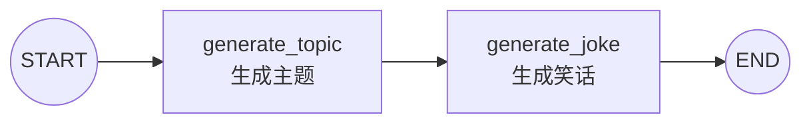
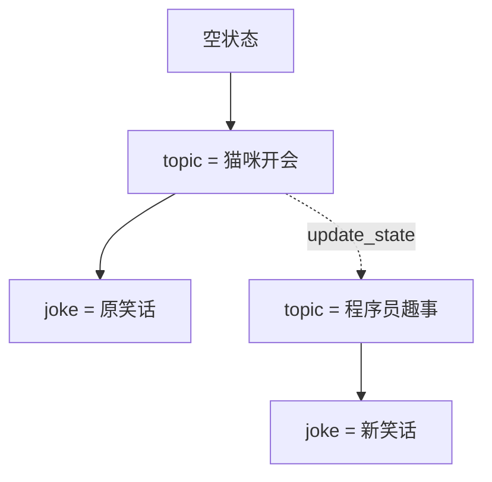

# 14｜LangGraph 内存时间旅行：状态历史、update_state 与分叉重放

这一节用一个很小的顺序工作流学习 LangGraph 的时间旅行：模型先生成笑话主题，再根据主题生成笑话。工作流完成后，我们读取历史检查点，找到“主题已经生成、笑话还没有生成”的时刻，修改主题，并从那里继续运行。

完整示例使用 `InMemorySaver`，不需要数据库；但调用模型仍然需要 API Key。

## 一句话理解

Checkpointer 会保存工作流运行过程中的状态快照；`update_state()` 可以基于旧快照创建一个带有新状态的分支，再用 `invoke(None, config=新配置)` 从该分支的下一节点继续执行。

## 最终流程

原始分支：



时间旅行产生第二条分支：



`update_state()` 不会返回到过去改写旧记录，而是从旧检查点创建一条新的状态路径。

## 1. 这个例子在学习什么

核心不是笑话生成，而是四个状态操作：

1. 使用 Checkpointer 保存执行历史。
2. 使用 `get_state_history()` 查看历史快照。
3. 使用 `update_state()` 修改某个旧快照的状态。
4. 使用新配置继续运行尚未执行的节点。

这类能力可以用于：

- 调试某一步为什么得到错误结果。
- 人工修正中间产物后继续工作流。
- 比较不同中间输入导致的结果差异。
- 从失败步骤之前重新执行。
- 为审批、编辑和回滚界面提供状态基础。

## 2. 应用、大模型与 LangGraph 的能力边界

| 层次 | 负责的事情 |
| --- | --- |
| 大模型 | 生成笑话主题，根据给定主题生成笑话 |
| LangGraph | 执行节点、保存检查点、读取历史、创建状态分支并恢复执行 |
| 应用 | 选择要修改哪个快照、验证新主题、展示分支、控制权限与调用成本 |

LangGraph 不会自动判断哪个历史快照最适合修改，也不会替应用决定谁有权限改状态。它提供状态和执行原语，具体产品逻辑仍由应用设计。

## 3. 为什么状态字段使用 total=False

工作流第一次调用时传入空字典：

```python
graph.invoke({}, config=config)
```

此时 `topic` 和 `joke` 都还不存在，所以状态声明为：

```python
class State(TypedDict, total=False):
    topic: str
    joke: str
```

`total=False` 表示这些键在静态类型层面允许暂时缺失。状态会逐步形成：

```text
{}
  ↓ generate_topic
{"topic": "猫咪开会"}
  ↓ generate_joke
{"topic": "猫咪开会", "joke": "……"}
```

这比把尚未产生的字段声明为必填更符合实际运行过程。

## 4. 两个节点如何更新状态

主题节点只返回 `topic`：

```python
def generate_topic(_: State):
    result = model.invoke(TOPIC_PROMPT)
    return {"topic": result.content}
```

笑话节点读取 `topic`，只返回 `joke`：

```python
def generate_joke(state: State):
    prompt = JOKE_PROMPT.format(topic=state["topic"])
    result = model.invoke(prompt)
    return {"joke": result.content}
```

节点返回的是局部更新，不需要复制整个状态。因为这里没有定义 Reducer，同名字段的新值会覆盖旧值。

完整示例还会检查主题和模型输出是否为非空字符串，避免坏数据继续进入下一个节点。

## 5. 原代码中的 f-string 引号问题

原写法：

```python
f"写一个关于{state["topic"]}的笑话"
```

不同 Python 版本对这种嵌套同类引号的支持不一致。为了兼容更多环境，可以改成：

```python
f"写一个关于{state['topic']}的笑话"
```

完整示例进一步使用 `str.format()`：

```python
JOKE_PROMPT.format(topic=topic)
```

这样既避免引号冲突，也方便把 Prompt 独立成常量。

## 6. 为什么必须配置 Checkpointer

编译图时加入：

```python
graph = builder.compile(checkpointer=InMemorySaver())
```

Checkpointer 会在工作流的关键步骤保存状态。如果不配置它：

- 无法按线程读取历史快照。
- 无法从旧检查点继续执行。
- `update_state()` 没有可操作的持久化状态基础。
- 中断恢复和时间旅行能力无法正常使用。

本例的 `InMemorySaver` 只把数据保存在当前 Python 进程中。程序退出后，全部历史都会消失。

## 7. thread_id 是历史所属的线程

```python
config = {
    "configurable": {
        "thread_id": "joke-time-travel-demo"
    }
}
```

`thread_id` 用来隔离不同工作流实例：

- 相同 `thread_id`：访问同一条状态历史。
- 不同 `thread_id`：创建相互隔离的历史。

首次执行、读取历史、更新状态和继续运行时，都必须使用能定位同一线程及检查点的配置。

生产应用通常使用会话 ID、任务 ID 或随机 UUID，不应让无关用户共享一个固定线程 ID。

## 8. 一次 invoke 为什么会产生多个快照

顺序图虽然只调用一次 `invoke()`，但内部经过多个 super-step。历史大致包括：

```text
next = generate_topic | values = {}
next = generate_joke | values = {topic}
next = END           | values = {topic, joke}
```

每个快照都描述“此刻已经有哪些状态，以及下一步准备执行什么”。

因此时间旅行的重点不是只找到某个值，而是找到一个合适的执行边界。

## 9. StateSnapshot 中的重要字段

`get_state_history()` 返回一组 `StateSnapshot`。常用字段包括：

| 字段 | 含义 |
| --- | --- |
| `values` | 当前快照保存的状态值 |
| `next` | 从这个快照继续时将执行的节点 |
| `config` | 定位线程和检查点的配置 |
| `metadata` | 步骤、来源、节点写入等信息 |
| `created_at` | 快照创建时间 |
| `parent_config` | 父检查点配置 |
| `tasks` | 当前步骤对应的任务、错误或中断 |

时间旅行最常使用 `values`、`next` 和 `config`。

## 10. 历史顺序是最新在前

```python
history = list(graph.get_state_history(config))
```

返回顺序通常是最新检查点在前。因此：

```python
history[0]
```

往往是最终状态，而不是最初状态。

如果要按实际执行时间展示，可以：

```python
for snapshot in reversed(history):
    print(snapshot.values)
```

不要把列表下标理解成固定的业务步骤编号。

## 11. 为什么不能直接使用 states[1]

原代码写成：

```python
update = states[1]
```

在当前两节点示例中，它可能刚好选中主题生成后的快照，但这个假设很脆弱：

- 增加节点后，历史数量会改变。
- 加入中断、重试或子图后，快照结构会改变。
- 同一线程多次运行后，会出现更多历史。
- 框架保存检查点的细节可能随版本演进。

更可靠的做法是按业务条件查找：

```python
for snapshot in history:
    if snapshot.next == ("generate_joke",):
        return snapshot
```

这里的含义非常明确：主题已经准备好，下一步将生成笑话。

## 12. update_state 到底做了什么

```python
fork_config = graph.update_state(
    fork_base.config,
    values={"topic": "程序员趣事"},
    as_node="generate_topic",
)
```

这段代码会：

1. 根据 `fork_base.config` 找到旧检查点。
2. 把 `topic` 更新为新值。
3. 创建一个新的检查点，而不是修改旧检查点。
4. 返回能定位新检查点的配置。

它不会立即执行 `generate_joke`。真正继续执行需要下一次 `invoke()`。

## 13. as_node 为什么重要

`as_node="generate_topic"` 的含义是：

> 把这次人工状态更新视为 `generate_topic` 节点刚刚输出的结果。

LangGraph 会据此判断新检查点之后应运行哪个节点。本图中，`generate_topic` 的后继节点是 `generate_joke`，所以新快照应满足：

```python
fork_snapshot.next == ("generate_joke",)
```

如果不提供 `as_node`，LangGraph 会在不歧义时尝试推断最后更新状态的节点。显式填写更适合教学和维护，也能减少图变复杂后的歧义。

## 14. 为什么恢复时输入是 None

```python
fork_result = graph.invoke(None, config=fork_config)
```

新状态已经保存在 `fork_config` 指向的检查点中，不需要再次传入初始状态。

传入 `None` 表示：

```text
读取该检查点
    ↓
查看 snapshot.next
    ↓
从 generate_joke 继续执行
```

如果重新传入 `{}`，容易让人误以为是在开始一个新的输入步骤。

## 15. Replay 与 Fork 的区别

### Replay：不修改状态，重新执行

```python
graph.invoke(None, config=old_snapshot.config)
```

它从旧快照继续，使用原来的 `topic` 再生成一次笑话。模型具有随机性时，结果可能与第一次不同。

### Fork：先修改状态，再执行

```python
new_config = graph.update_state(
    old_snapshot.config,
    {"topic": "程序员趣事"},
    as_node="generate_topic",
)
graph.invoke(None, config=new_config)
```

它使用新主题走出另一条分支。

| 对比项 | Replay | Fork |
| --- | --- | --- |
| 是否修改旧快照中的值 | 否 | 基于旧快照创建新值 |
| 是否重新执行后续节点 | 是 | 是 |
| 原历史是否保留 | 是 | 是 |
| 典型用途 | 重试、复现 | 修正中间状态、比较方案 |

## 16. 原分支不会被覆盖

在创建分叉前保存原最终快照：

```python
original_latest = graph.get_state(config)
```

完成新分支后仍可读取它：

```python
original_state = graph.get_state(original_latest.config)
```

这说明时间旅行不是对历史做原地编辑。检查点通过父子关系形成分支，旧结果仍然存在。

如果业务真的需要删除旧历史，应由应用调用专门的数据清理能力，并处理审计、权限和保留策略；`update_state()` 本身不等于删除。

## 17. Reducer 会影响状态更新方式

本例的 `topic` 和 `joke` 没有 Reducer，所以新值直接覆盖旧值：

```python
{"topic": "程序员趣事"}
```

如果字段定义了 Reducer，`update_state()` 也会遵循该 Reducer。例如列表字段使用 `operator.add` 时，新列表可能被追加，而不是替换。

消息状态常使用 `add_messages`：同 ID 消息会被替换，不同 ID 消息会被追加。修改历史状态前必须理解每个字段的合并规则。

## 18. 配置与运行

复制环境变量模板：

```bash
# Windows PowerShell
Copy-Item .env.example .env

# macOS / Linux
cp .env.example .env
```

填写模型服务配置：

```env
OPENAI_API_KEY=your_api_key_here
OPENAI_BASE_URL=https://openrouter.ai/api/v1
MODEL_NAME=openai/gpt-4o-mini
```

时间旅行演示配置：

```env
JOKE_TIME_TRAVEL_THREAD_ID=joke-time-travel-demo
JOKE_FORK_TOPIC=程序员趣事
```

运行：

```bash
python langgraph_in_memory_time_travel.py
```

由于模型输出具有随机性，实际主题和笑话不会与文档完全相同。

## 19. 预期观察结果

输出结构大致如下：

```text
执行原始工作流……
原主题：猫咪开会
原笑话：……

检查点历史（最新在前）：
step=  2 | source=loop   | next=('END',) | checkpoint_id=...
step=  1 | source=loop   | next=('generate_joke',) | checkpoint_id=...
step=  0 | source=loop   | next=('generate_topic',) | checkpoint_id=...

选中的分叉起点：
topic='猫咪开会'
next=('generate_joke',)

从修改后的检查点继续执行……
新主题：程序员趣事
新笑话：……

原分支仍然可以读取：
原主题：猫咪开会
原笑话：……
```

真实的 `step`、`source`、检查点数量和 ID 以当前 LangGraph 版本的运行结果为准。

## 20. 原始学习代码中的实用改进

完整示例做了这些调整：

1. 修复嵌套双引号可能引起的 f-string 兼容性问题。
2. 将状态字段声明为可逐步产生，允许第一次输入为空。
3. 从环境变量读取模型、服务地址、线程 ID 和新主题。
4. 把模型创建和图构建封装成函数，便于测试。
5. 检查模型是否返回非空文本。
6. 不再依赖 `states[1]`，改为按 `snapshot.next` 查找。
7. 显式传入 `as_node="generate_topic"`。
8. 在继续执行前检查新快照是否指向 `generate_joke`。
9. 展示原分支在 Fork 后仍然可读。
10. 增加 `if __name__ == "__main__"`，导入模块时不会调用模型。
11. 使用 StubModel 完成无真实 API 的分支测试。

## 21. 常见错误

### 没有配置 Checkpointer

没有检查点就不能可靠读取状态历史和从旧快照继续。

### 没有传 thread_id

带 Checkpointer 的图需要知道状态属于哪个线程：

```python
{"configurable": {"thread_id": "..."}}
```

### 把历史列表下标当作固定步骤

历史默认最新在前，而且节点、重试和多次运行都会改变下标。应按 `next`、状态值、消息 ID 或元数据选择快照。

### 选择了最终快照

最终快照的 `next` 为空，从它调用 `invoke(None, ...)` 不会再执行节点。要重放笑话节点，应选择 `next == ("generate_joke",)` 的快照。

### 更新状态后没有使用返回的新配置

`update_state()` 返回新检查点配置。后续执行必须使用这个返回值，而不是原来的线程级配置。

### as_node 写错

如果把更新伪装成不合适的节点输出，LangGraph 可能安排错误的后续节点。先检查：

```python
graph.get_state(new_config).next
```

### 以为 update_state 会直接运行节点

它只创建新状态快照。还需要：

```python
graph.invoke(None, config=new_config)
```

### 程序重启后内存历史消失

`InMemorySaver` 仅适合教学和测试。跨进程持久化应使用 PostgreSQL 等持久化 Checkpointer。

### Replay 重复产生外部副作用

从旧快照继续会真实重跑后续节点。若节点会发邮件、付款或写数据库，必须增加幂等键、审批和审计。

## 22. 生产使用注意事项

- 使用持久化 Checkpointer，而不是 `InMemorySaver`。
- 为线程和检查点访问增加用户权限校验。
- 不允许前端任意提交 `checkpoint_id` 并读取他人状态。
- 对人工修改后的状态执行运行时验证。
- 记录修改人、旧值、新值、时间和原因。
- 在工作流版本变化后验证旧检查点是否仍然兼容。
- 给模型和外部工具调用设置成本与次数上限。
- 对有副作用的节点实现幂等。
- 制定历史数据保留、归档和删除策略。
- 在界面上明确区分原分支与新分支。

## 23. 复习问答

<details>
<summary>1. get_state_history() 返回什么？</summary>

它返回某个线程的 `StateSnapshot` 历史，默认通常是最新快照在前。

</details>

<details>
<summary>2. 为什么选择 next=('generate_joke',) 的快照？</summary>

因为这个执行边界表示主题已经生成，而笑话节点尚未运行，正适合修改主题后重新生成笑话。

</details>

<details>
<summary>3. update_state() 会修改旧检查点吗？</summary>

不会。它基于指定检查点创建一个包含状态更新的新检查点，因此形成分支。

</details>

<details>
<summary>4. as_node='generate_topic' 表示什么？</summary>

表示把人工更新视为主题节点刚刚完成的输出，LangGraph 据此安排该节点之后的执行路径。

</details>

<details>
<summary>5. 为什么继续执行时传入 None？</summary>

因为状态已经保存在新检查点中；`None` 表示直接从该检查点的待执行节点继续。

</details>

<details>
<summary>6. Replay 与 Fork 最大的区别是什么？</summary>

Replay 不修改状态就重跑后续步骤；Fork 先创建状态更新，再从新分支执行。

</details>

<details>
<summary>7. InMemorySaver 为什么不适合生产环境？</summary>

它的历史只存在于当前进程，重启后会丢失，也不适合多实例服务共享状态。

</details>

<details>
<summary>8. update_state() 为什么需要理解 Reducer？</summary>

状态更新会遵循字段的合并规则；带 Reducer 的字段可能追加或按 ID 合并，而不是简单覆盖。

</details>

<details>
<summary>9. update_state() 后怎样确认路径正确？</summary>

用 `graph.get_state(new_config).next` 检查新快照准备执行的节点。

</details>

## 24. 可以继续练习

- 不修改主题，直接从旧快照 Replay，比较两次笑话是否相同。
- 增加第三个“评价笑话”节点，从不同位置创建分支。
- 让用户从历史列表中选择检查点，而不是程序自动选择。
- 给 `topic` 加长度校验，拒绝空值和过长内容。
- 比较省略 `as_node` 与显式指定 `as_node` 的结果。
- 为状态增加 `revision` 字段，记录分支版本。
- 使用 `metadata["source"]` 区分普通执行和状态更新。
- 将 `InMemorySaver` 替换为 `PostgresSaver`，重启程序后继续读取历史。
- 为含副作用的节点加入幂等键，验证 Replay 不会重复操作。

## 官方资料

- [LangGraph Persistence](https://docs.langchain.com/oss/python/langgraph/persistence)
- [LangGraph Time Travel](https://docs.langchain.com/oss/python/langgraph/use-time-travel)
- [get_state_history API](https://reference.langchain.com/python/langgraph/pregel/main/Pregel/get_state_history)
- [update_state API](https://reference.langchain.com/python/langgraph/pregel/main/Pregel/update_state)
- [StateSnapshot API](https://reference.langchain.com/python/langgraph/types/StateSnapshot)

## 完整源码

见 [`langgraph_in_memory_time_travel.py`](../langgraph_in_memory_time_travel.py)。
