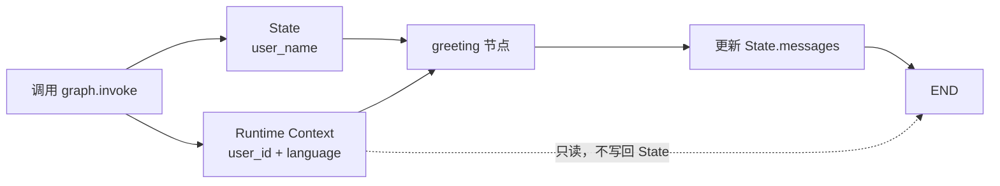

# 15. LangGraph Runtime Context：区分运行上下文与可变状态

这一篇用一个最小问候工作流，回答一个很容易混淆的问题：**什么数据应该放进 State，什么数据应该通过 Runtime Context 传给节点？**

示例代码：[langgraph_runtime_context.py](../langgraph_runtime_context.py)

## 一句话理解

- **State** 是工作流正在处理、并允许节点逐步更新的数据。
- **Runtime Context** 是一次运行所依赖的只读背景信息，例如当前用户、语言、租户或数据库连接。

在本例中：

- `user_name` 会影响业务结果，也可以被节点修改，所以放在 `State`；
- `user_id` 和 `language` 由调用方为本次运行提供，节点只读取，所以放在 `ContextSchema`；
- `messages` 是节点生成并写回的结果，所以也属于 `State`。

## 运行流程



调用时有两条独立的数据通道：

```python
result = graph.invoke(
    {"user_name": "小明"},
    context=ContextSchema(user_id="user_123", language="zh"),
)
```

第一项是初始 `State`，`context=` 则是本次运行的 Runtime Context。两者会同时注入节点，但用途不同。

## 先区分三层能力

这段程序没有调用大模型。它展示的是 LangGraph 的运行机制，不是模型能力。

| 层级 | 本例中的职责 | 由谁实现 |
| --- | --- | --- |
| 应用能力 | 决定哪些字段是上下文、读取环境变量、选择问候规则、校验输入 | 我们编写的 Python 代码 |
| LangGraph 能力 | 定义 State、声明 `context_schema`、把 `Runtime` 注入节点、执行节点和边 | LangGraph |
| 大模型能力 | 理解或生成自然语言 | 本例未使用 |

因此，“系统能根据语言问候用户”不是 LangGraph 自动提供的业务功能。LangGraph 提供数据通道和执行框架，具体问候规则仍由应用代码决定。

## State 与 Runtime Context 对比

| 对比项 | State | Runtime Context |
| --- | --- | --- |
| 主要用途 | 保存工作流正在处理的数据 | 提供本次运行依赖的背景信息 |
| 节点能否更新 | 可以通过返回字典更新 | 应视为只读 |
| 是否沿节点流转 | 是 | 由运行时自动注入 |
| 是否进入检查点 | 使用 Checkpointer 时会保存 | 不属于图状态，不随状态一起持久化 |
| 常见数据 | 消息、草稿、审批状态、计算结果 | 用户 ID、租户 ID、语言、数据库连接、服务客户端 |
| 调用方式 | `graph.invoke(initial_state)` | `graph.invoke(..., context=context)` |

一个实用判断方法是：

> 如果节点完成工作后需要把它改成新值，它更可能属于 State；如果它是调用方为本次运行提供的依赖或身份信息，它更可能属于 Runtime Context。

## 代码逐段理解

### 1. 用 dataclass 定义 Context Schema

```python
Language = Literal["en", "zh"]


@dataclass(frozen=True)
class ContextSchema:
    user_id: str
    language: Language = "en"
```

`ContextSchema` 描述节点可以从运行时读取哪些字段。

- `user_id` 没有默认值，创建实例时必须提供；
- `language` 默认是英文；
- `Literal["en", "zh"]` 让类型检查器知道允许的取值；
- `frozen=True` 能阻止普通代码直接给字段重新赋值，更符合“上下文只读”的设计意图。

需要注意：`frozen=True` 只是 Python 层面的防误改措施，不是身份认证或安全边界。`user_id` 必须由可信的应用层根据登录态确定，不能直接相信用户随请求提交的任意字符串。

### 2. 用 total=False 定义可逐步构建的 State

```python
class State(TypedDict, total=False):
    messages: list[str]
    user_name: str
```

原始代码把两个字段都声明成必填，却又执行 `graph.invoke({})`，类型定义和调用方式不一致。

加入 `total=False` 后，初始 State 可以为空。节点通过：

```python
user_name = state.get("user_name", "Guest").strip() or "Guest"
```

为缺失值或空白值提供 `Guest` 兜底。

如果业务上要求用户名必须存在，也可以保留必填定义，并在调用时始终传入：

```python
graph.invoke({"user_name": "小明"}, context=context)
```

### 3. 把 Context Schema 注册到图中

```python
builder = StateGraph(State, context_schema=ContextSchema)
```

这里同时告诉 LangGraph 两种 Schema：

- `State`：图中可变数据的结构；
- `ContextSchema`：节点运行时可读取的上下文结构。

旧资料中可能出现 `config_schema`，当前 API 推荐使用 `context_schema`。

### 4. 在节点参数中接收 Runtime

```python
def greeting_node(
    state: State,
    runtime: Runtime[ContextSchema],
) -> State:
```

LangGraph 在执行节点时，会根据参数把 `Runtime` 自动注入进来，不需要手动调用 `greeting_node`。

泛型参数 `ContextSchema` 让编辑器知道：

```python
runtime.context.user_id
runtime.context.language
```

是合法字段，也能提供自动补全和类型检查。

`Runtime` 不只包含 `context`。当前版本还可以提供 Store、流式写入器等运行能力，但本例只使用 `runtime.context`。

### 5. 从 State 和 Context 读取不同信息

```python
greeting = greetings[runtime.context.language]
user_name = state.get("user_name", "Guest").strip() or "Guest"
```

这里刻意从两个来源读取数据：

- 语言来自 `runtime.context`，因为它是本次调用的运行背景；
- 用户名来自 `state`，因为它是工作流正在处理的业务数据。

节点没有返回 `user_id` 或 `language`。Context 不需要复制进 State 才能继续被其他节点读取；同一次运行中的其他节点也可以通过自己的 `runtime` 参数读取它。

### 6. 返回值只更新 State

```python
return {
    "messages": [f"{greeting}，{user_name}！"],
}
```

节点返回的字典用于更新 State，而不是 Context。

本例没有给 `messages` 配置 Reducer，因此新列表会覆盖旧列表。假设初始状态是：

```python
{"messages": ["旧消息"], "user_name": "小明"}
```

节点执行后，`messages` 会变成：

```python
["你好，小明！"]
```

如果需要追加而不是覆盖，可以使用 Reducer：

```python
import operator
from typing import Annotated


class State(TypedDict, total=False):
    messages: Annotated[list[str], operator.add]
    user_name: str
```

使用消息对象时，通常还可以直接继承 `MessagesState`，由 `add_messages` 处理消息合并。

### 7. 调用时传入 Context 实例

```python
context = ContextSchema(
    user_id="user_123",
    language="zh",
)

result = graph.invoke(
    {"user_name": "小明"},
    context=context,
)
```

因为节点采用属性访问：

```python
runtime.context.language
```

调用方也传入 `ContextSchema` 实例，二者保持一致。

如果 Context Schema 使用 `TypedDict`，节点通常会改为字典访问：

```python
runtime.context["language"]
```

不要一边把上下文当 dataclass，一边又在调用时依赖普通字典的行为。统一类型可以减少运行时错误。

## Context、RunnableConfig、Checkpointer 与 Store

这四个概念经常一起出现，但并不相同。

| 概念 | 解决的问题 | 示例 |
| --- | --- | --- |
| State | 当前流程在处理什么 | `user_name`、`messages` |
| Runtime Context | 本次运行依赖什么背景或服务 | `user_id`、`language`、数据库连接 |
| RunnableConfig | 如何执行与追踪这次调用 | `thread_id`、标签、回调、递归限制 |
| Checkpointer | 如何按线程保存 State 的检查点 | `InMemorySaver`、`PostgresSaver` |
| Store | 如何保存可跨线程复用的数据 | `InMemoryStore`、`PostgresStore` |

### Runtime Context 不是短期记忆

Context 是 run-scoped，也就是“本次运行范围内”的数据。它不属于 State，所以不会因为配置了 Checkpointer 就自动成为线程记忆。

如果下一次调用仍需要相同的 `user_id` 和 `language`，应用层应该再次传入 Context。

### Checkpointer 保存的是 State

若要保存消息、审批状态或中间结果，应编译时加入 Checkpointer：

```python
graph = builder.compile(checkpointer=InMemorySaver())
```

调用时还要提供 `thread_id`。本例不需要中断、恢复或历史状态，所以删除了原始代码中未使用的 `InMemorySaver` 导入。

### Store 保存跨线程数据

若要读取某个用户长期保存的偏好，可以给图配置 Store，再把 `user_id` 放在 Context 中作为命名空间的一部分：

```python
namespace = (runtime.context.user_id, "preferences")
memories = runtime.store.search(namespace)
```

此时：

- Context 告诉节点“当前是谁”；
- Store 保存“这个用户过去留下了什么”；
- State 保存“当前工作流正在处理什么”。

本例没有长期记忆需求，因此也删除了未使用的 `InMemoryStore` 导入。

### RunnableConfig 仍然可以单独注入

如果节点需要读取 `thread_id` 等执行配置，可以额外接收 `RunnableConfig`。`Runtime` 本身不等于 `RunnableConfig`，不要把它们混成一个概念。

## 为什么 user_id 更适合放在 Context

假设把 `user_id` 放进 State，某个节点就可能返回：

```python
return {"user_id": "another_user"}
```

后续节点如果据此读取长期记忆，就可能访问错误的用户命名空间。

把身份信息放到只读 Context，并让可信的应用层创建 Context，可以更清楚地表达：

1. `user_id` 是运行依赖，不是模型生成内容；
2. 节点不应该通过 State 更新它；
3. 访问 Store 或数据库时，应以经过认证的 Context 为准。

不过，数据放进 Context 并不会自动变得可信。真正的安全措施仍然包括身份验证、授权检查、数据库隔离和服务端校验。

## 环境变量

示例使用三个不含密钥的环境变量：

```dotenv
RUNTIME_USER_ID=user_123
RUNTIME_LANGUAGE=zh
RUNTIME_USER_NAME=小明
```

- `RUNTIME_USER_ID`：不能为空；
- `RUNTIME_LANGUAGE`：只支持 `en` 或 `zh`；
- `RUNTIME_USER_NAME`：为空时使用 `Guest`。

环境变量只是为了方便演示。真实 Web 应用中的 `user_id` 通常应来自服务端验证后的登录会话，而不是让用户在 `.env` 或请求正文中随意指定。

## 运行方式

安装依赖：

```bash
pip install -r requirements.txt
```

复制环境变量模板：

```bash
# Windows PowerShell
Copy-Item .env.example .env

# macOS / Linux
cp .env.example .env
```

运行：

```bash
python langgraph_runtime_context.py
```

这个示例不调用大模型，不需要 API Key，也不需要数据库。

## 预期输出

使用模板中的中文配置时，会看到类似结果：

```text
本次调用的 user_id：user_123
本次调用的 language：zh
最终 State：{'user_name': '小明', 'messages': ['你好，小明！']}
```

把 `RUNTIME_LANGUAGE` 改成 `en` 后，问候语会变为：

```text
Hello，小明！
```

`user_id` 被节点读取的能力虽然已经存在，但这个最小问候节点没有把它打印进消息内容，也没有写回 State。演示程序在图外打印它，是为了帮助观察两条数据通道。

## 原始代码中的关键修正

### 1. 删除未使用的导入

原始代码导入了：

```python
AnyMessage
InMemorySaver
InMemoryStore
```

但没有使用。保留它们会让初学者误以为 Runtime Context 必须依赖消息类型、Checkpointer 或 Store。实际并不需要，所以最小示例将它们删除。

### 2. 让空初始 State 合法

原始代码声明必填字段后调用 `graph.invoke({})`。现在通过 `total=False` 允许字段暂时不存在，并给用户名设置兜底值。

### 3. 统一 Context 的实际类型

原始节点使用：

```python
runtime.context.language
```

这表示代码期待 dataclass 实例。修正版调用时传入：

```python
context=ContextSchema(...)
```

避免把普通字典和属性访问混用。

### 4. 对配置值进行校验

修正版会拒绝空 `user_id` 和不支持的语言值，使错误在进入图之前就暴露出来。

### 5. 强调 messages 的覆盖语义

原始注释写了“覆盖”，但没有解释原因。真正原因是该字段没有 Reducer；同名字段的新值使用默认更新行为覆盖旧值。

## 常见错误

### 错误一：节点直接修改 Context

```python
runtime.context.user_id = "new_user"
```

Context 应作为只读依赖使用。本例的冻结 dataclass 也会阻止这种赋值。

### 错误二：把每一步都要修改的数据放进 Context

例如文章草稿会被多个节点逐步修改，它应该放进 State。Context 不适合承担状态机的数据流转职责。

### 错误三：认为 Context 会被 Checkpointer 保存

Checkpointer 保存图状态快照。Context 不属于 State，新的调用仍应由应用层提供所需 Context。

### 错误四：把 Context 当成 Store

Context 适合携带本次运行的引用或依赖，不适合存放不断增长的用户历史。跨线程数据应交给 Store 或业务数据库。

### 错误五：把客户端提交的 user_id 当成可信身份

Context 的结构清晰不等于数据可信。服务端必须先验证用户身份，再构造 Context。

### 错误六：传入字典却使用属性访问

Context 的定义、传入值和读取方式要一致：dataclass 用属性访问，TypedDict 用键访问。

## 复习问题

1. State 和 Runtime Context 最核心的区别是什么？
2. 为什么 `user_name` 在本例中属于 State？
3. 为什么 `user_id` 更适合由 Context 提供？
4. `frozen=True` 能否代替身份认证？
5. Context 会不会自动保存到 Checkpointer？
6. `messages` 为什么会覆盖旧列表？
7. Runtime Context 与 Store 如何配合实现个性化？
8. `Runtime` 和 `RunnableConfig` 是同一个对象吗？

## 扩展练习

1. 新增 `timezone` 上下文字段，根据时区显示不同时间。
2. 把 `ContextSchema` 改成 `TypedDict`，同时修改节点读取方式。
3. 给 `messages` 添加 Reducer，观察覆盖和追加的区别。
4. 增加第二个节点，验证同一次运行中的两个节点都能读取相同 Context。
5. 编译时加入 `InMemoryStore`，按 `user_id` 保存并读取用户偏好。
6. 加入 Checkpointer，对比历史 State 中有哪些字段、Context 中有哪些字段。
7. 模拟 Web 应用：从经过验证的会话创建 Context，而不是直接接受请求中的用户 ID。

## 官方资料

- [StateGraph API：context_schema](https://reference.langchain.com/python/langgraph/graph/state/StateGraph)
- [Runtime API](https://reference.langchain.com/python/langgraph/runtime/Runtime)
- [get_store API](https://reference.langchain.com/python/langgraph/config/get_store)

## 本章小结

Runtime Context 的价值不在于“多一个传参方式”，而在于明确数据责任：

- State 保存节点要处理和更新的数据；
- Runtime Context 提供一次运行所依赖的身份、配置和服务；
- Checkpointer 保存 State 历史；
- Store 保存跨线程数据；
- 应用层负责验证身份、构造 Context，并定义真正的业务规则。

边界清楚后，工作流会更容易测试，也更不容易把用户身份、业务状态和长期记忆混在一起。
